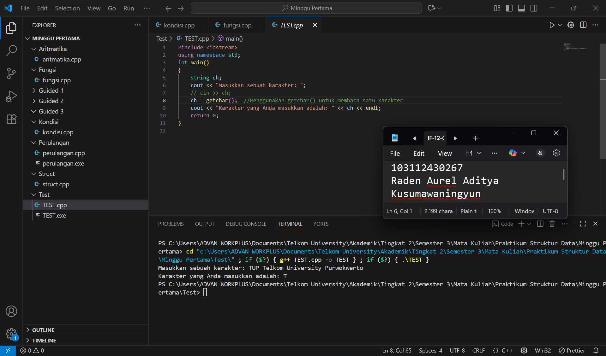
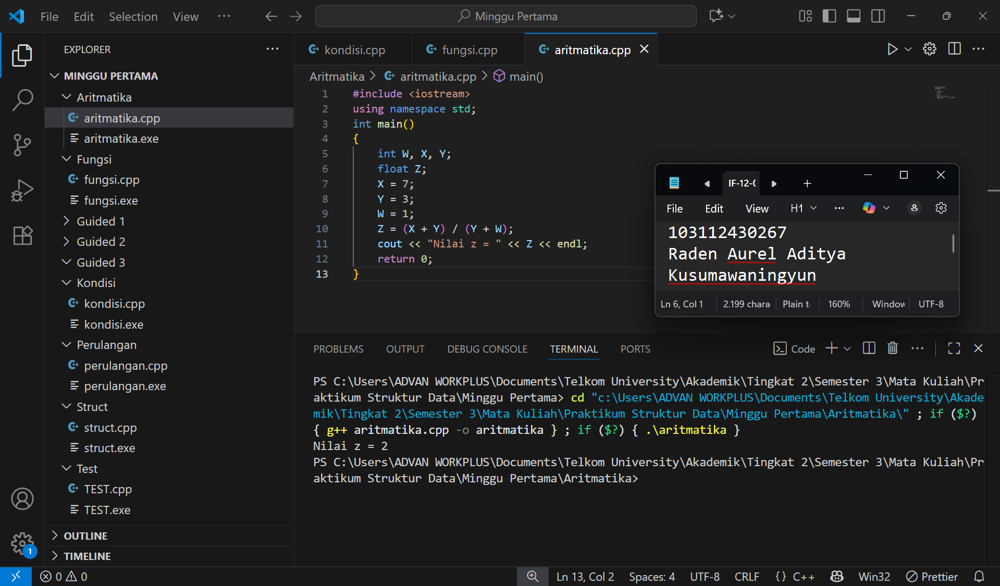
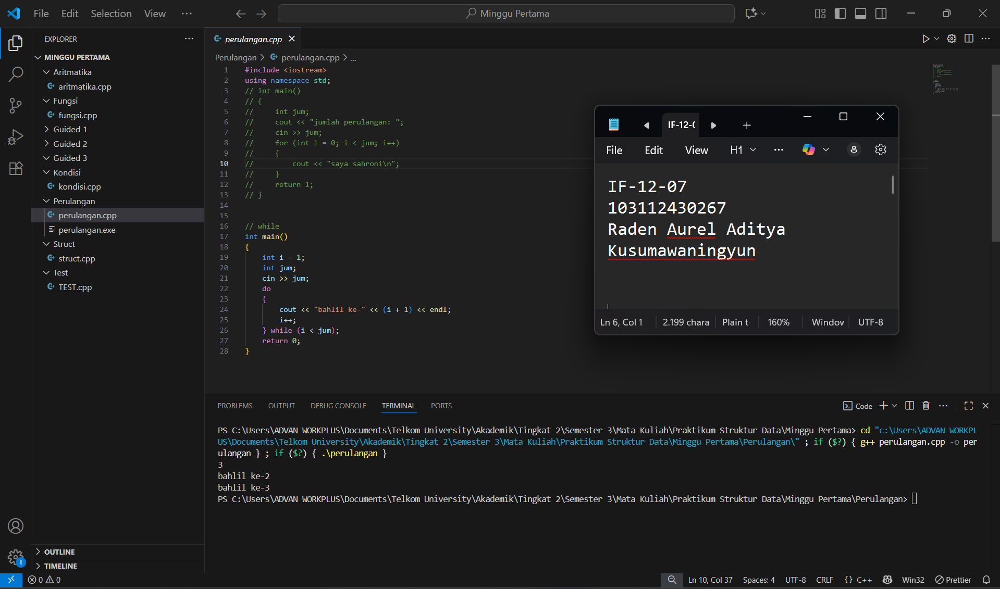
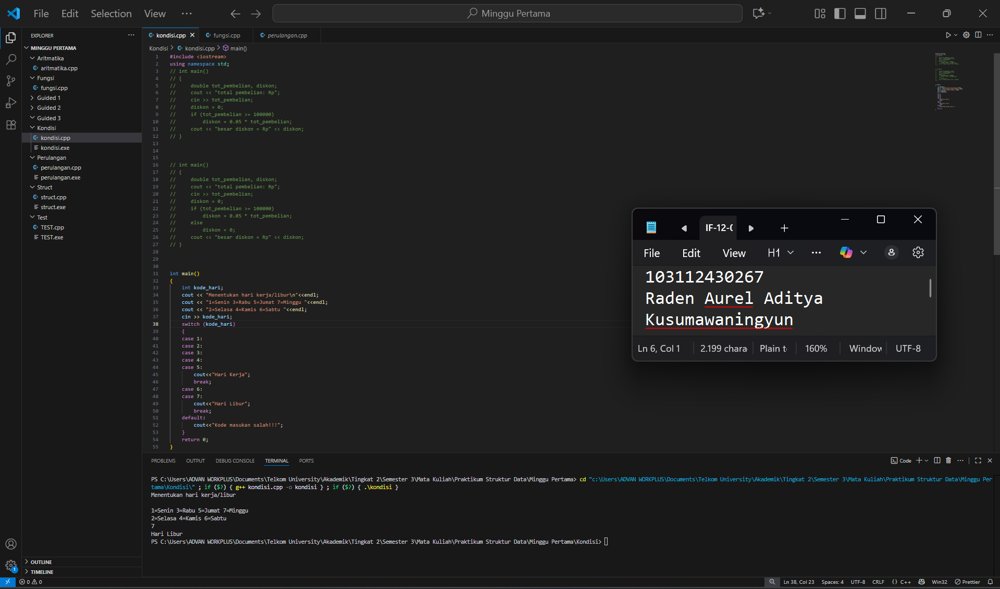
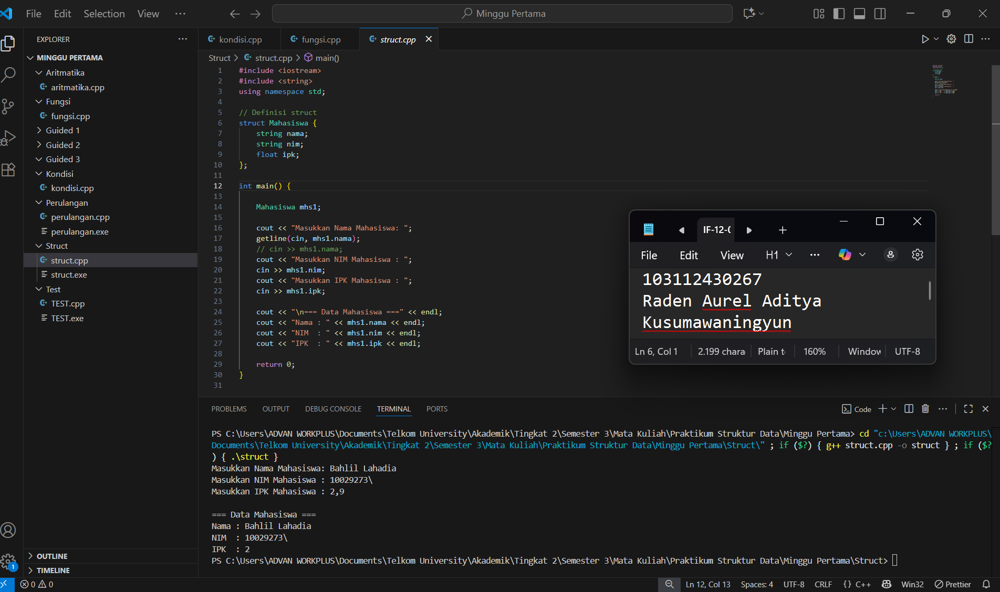
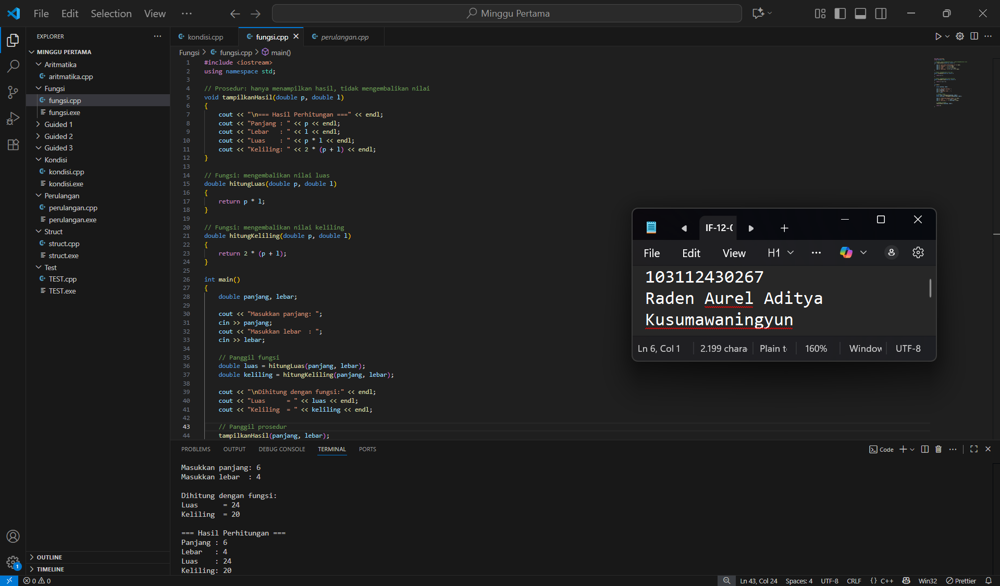
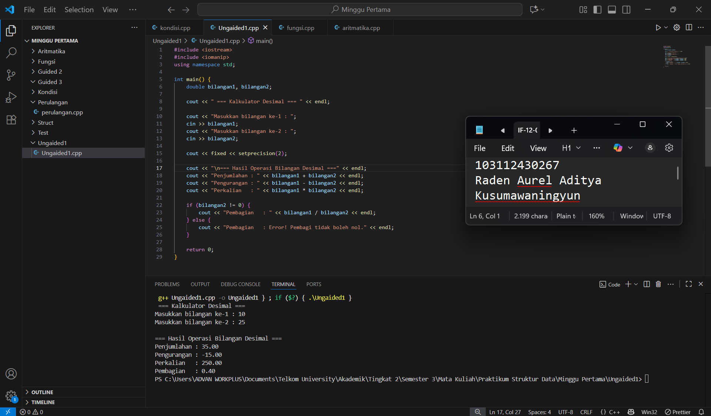
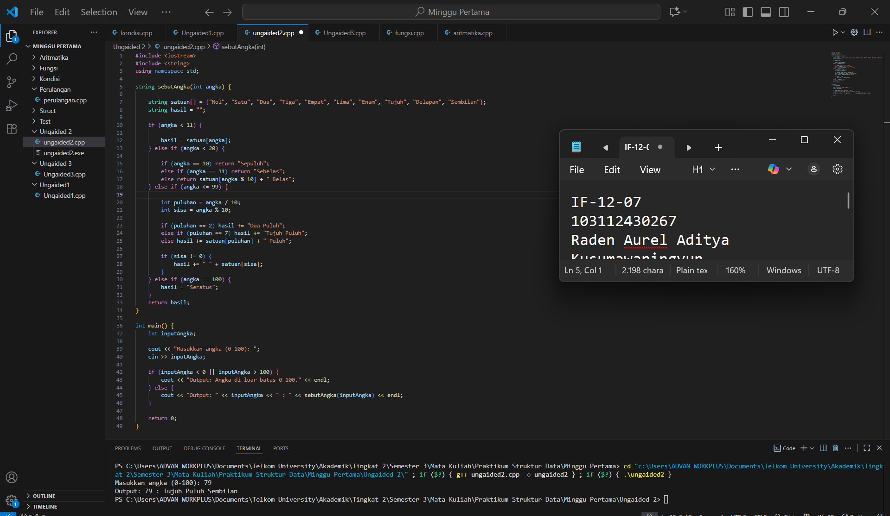
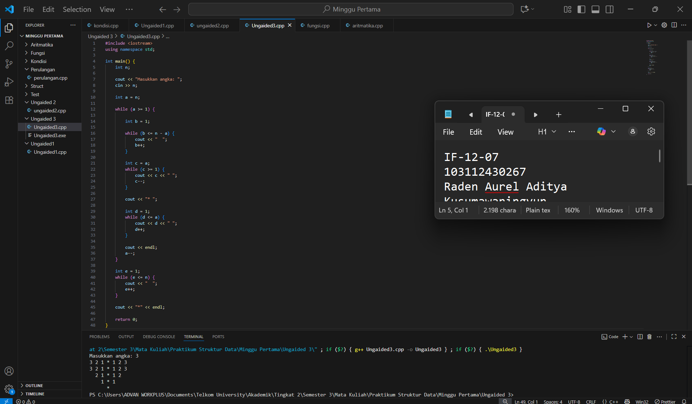

 <h1 align="center">Laporan Praktikum Modul 1 <br> Pengenalan CPP</h1>
<p align="center">Raden Aurel Aditya Kusumawaningyun- 103112430267</p>

## Dasar Teori
Bahasa C++ adalah evolusi signifikan dari Bahasa yang telah ada yaitu bahasa C, yang diciptakan oleh Bjarne Stroustrup pada awal 1980-an di AT&T Bell Laboratories dengan tujuan utama menambahkan fitur kelas (class) sebagai fondasi utama dari Pemrograman Berorientasi Objek (OOP). Nama 'C++' sendiri, yang menggunakan operator increment, secara tegas menunjukkan bahwa bahasa ini adalah versi yang sudah naik level dari pendahulunya, menyajikan empat pilar OOP yang esensial diantaranya Enkapsulasi, Pewarisan (Inheritance), Polimorfisme, dan Abstraksi, yang memungkinkan kita merancang struktur kode secara modular dan efisien. C++ diklasifikasikan sebagai bahasa tingkat menengah karena fleksibilitasnya dalam memanipulasi memori namun tetap mudah digunakan, dan sebagai bahasa yang dikompilasi, ia membutuhkan compiler untuk menerjemahkan kode sumbernya menjadi program yang dapat dieksekusi. Perlu dipahami juga bahwa C++ juga bersifat case-sensitive menjadi modal dasar agar Anda dapat merancang program yang tidak hanya berfungsi, tetapi juga terstruktur dan reusable.

## Guided

### soal 1
Test CPP
```go
#include <iostream>
using namespace std;
int main()
{
    string ch;
    cout << "Masukkan sebuah karakter: ";
    // cin >> ch;
    ch = getchar();  //Menggunakan getchar() untuk membaca satu karakter
    cout << "Karakter yang Anda masukkan adalah: " << ch << endl;
    return 0;
}

```

Kode ini adalah demonstrasi sederhana bagaimana cara spesifik fungsi (getchar()) untuk mengambil awal karakter dari semua karakter inputan yang di inputkan oleh si pengguna.

> Output
> 
> Berikut SS VS Code dari Program Soal No 1

### soal 2
Aritmatika

```go
#include <iostream>
using namespace std;
int main()
{
    int W, X, Y;
    float Z;
    X = 7;
    Y = 3;
    W = 1;
    Z = (X + Y) / (Y + W);
    cout << "Nilai z = " << Z << endl;
    return 0;
}

```

Kode ini dirancang untuk menghitung nilai variabel Z dengan operasi (X + Y) / (Y + W). Meskipun variabel hasil Z dideklarasikan sebagai float, mempunyai sebab untuk tidak keluar bilangan desimalnya terletak pada operan (X, Y, W) yang semuanya bertipe int. Dalam C++, operasi pembagian yang melibatkan dua bilangan bulat (10 / 4) akan menghasilkan pembagian integer, yang secara otomatis nantinya mengabaikan sisa pembagian dan hanya menghasilkan nilai bulatnya dari 2.0 menjadi 2 yang akan di simpan di variabel Z.

> Output
> 
> Berikut SS VS Code dari Program Soal No 2


### soal 3
Perulangan

```go
#include <iostream>
using namespace std;
// int main()
// {
//     int jum;
//     cout << "jumlah perulangan: ";
//     cin >> jum;
//     for (int i = 0; i < jum; i++)
//     {
//         cout << "saya sahroni\n";
//     }
//     return 1;
// }


// while
int main()
{
    int i = 1;
    int jum;
    cin >> jum;
    do
    {
        cout << "bahlil ke-" << (i + 1) << endl;
        i++;
    } while (i < jum);
    return 0;
}

```

Kode Perulangan ini adalah perulangan yang eksekusi awalnya akan tetap dieksekusi dalam kondisi apa pun dan menentukan eksekusi kedua setelah keluar hasil awal. Berbeda sama perulangan while biasa yang ngecek di awal, do-while ini disebut exit-controlled loop karena pengecekan kondisinya ada di akhir. hal tersebut penting sekali kalau untuk program memastikan ada langkah yang harus dikerjakan minimal satu kali, misalnya menampilkan menu utama atau memproses input pertama dari pengguna.

> Output
> 
> Berikut SS VS Code dari Program Soal No 3


### soal 4
Kondisi

```go
#include <iostream>
using namespace std;
// int main()
// {
//     double tot_pembelian, diskon;
//     cout << "total pembelian: Rp";
//     cin >> tot_pembelian;
//     diskon = 0;
//     if (tot_pembelian >= 100000)
//         diskon = 0.05 * tot_pembelian;
//     cout << "besar diskon = Rp" << diskon;
// }


// int main()
// {
//     double tot_pembelian, diskon;
//     cout << "total pembelian: Rp";
//     cin >> tot_pembelian;
//     diskon = 0;
//     if (tot_pembelian >= 100000)
//         diskon = 0.05 * tot_pembelian;
//     else
//         diskon = 0;
//     cout << "besar diskon = Rp" << diskon;
// }


int main()
{
    int kode_hari;
    cout << "Menentukan hari kerja/libur\n"<<endl;
    cout << "1=Senin 3=Rabu 5=Jumat 7=Minggu "<<endl;
    cout << "2=Selasa 4=Kamis 6=Sabtu "<<endl;
    cin >> kode_hari;
    switch (kode_hari)
    {
    case 1:
    case 2:
    case 3:
    case 4:
    case 5:
        cout<<"Hari Kerja";
        break;
    case 6:
    case 7:
        cout<<"Hari Libur";
        break;
    default:
        cout<<"Kode masukan salah!!!";
    }
    return 0;
}

```

Kode program ini memperlihatkan salah satu cara terbaik untuk mengambil keputusan dalam program. Meskipun file ini juga menampilkan contoh solusi menggunakan struktur if dan if-else, yang kita eksekusi dan fokuskan adalah struktur kontrol switch.

Struktur switch-case ini struktur yang sangat tepat dalam menangani banyak kondisi yang berasal dari satu variabel input (kode_hari). Kode ini secara spesifik bertujuan menentukan apakah hari yang dimasukkan pengguna termasuk Hari Kerja atau Hari Libur. Keunggulan utama dalam implementasi ini adalah penggunaan fitur beberapa case yang berurutan tanpa perintah break. Hal ini sangat efektif untuk mengelompokkan banyak nilai input. Mekanisme ini membuat kode menjadi jauh lebih ringkas, rapi, dan mudah dibaca dibandingkan jika kita harus menggunakan deretan panjang struktur if-else if untuk setiap kemungkinan hari.

> Output
> 
> Berikut SS VS Code dari Program Soal No 4


### soal 5
Struct

```go
#include <iostream>
#include <string>
using namespace std;

// Definisi struct
struct Mahasiswa {
    string nama;
    string nim;
    float ipk;
};

int main() {

    Mahasiswa mhs1;

    cout << "Masukkan Nama Mahasiswa: ";
    getline(cin, mhs1.nama);
    // cin >> mhs1.nama;
    cout << "Masukkan NIM Mahasiswa : ";
    cin >> mhs1.nim;
    cout << "Masukkan IPK Mahasiswa : ";
    cin >> mhs1.ipk;

    cout << "\n=== Data Mahasiswa ===" << endl;
    cout << "Nama : " << mhs1.nama << endl;
    cout << "NIM  : " << mhs1.nim << endl;
    cout << "IPK  : " << mhs1.ipk << endl;

    return 0;
}


```

Kode ini mendemonstrasikan penggunaan struct dalam C++ untuk mengelompokkan data dengan tipe berbeda ke dalam satu kesatuan Logis. Dengan membuat variabel dari struct tersebut yaitu mhs1, kita dapat mengakses setiap anggota data  menggunakan operator titik(.). Penggunaan Struct ini adalah fondasi penting dalam pemrograman untuk membuat struktur data yang kompleks dan terorganisasi rapi.

> Output
> 
> Berikut SS VS Code dari Program Soal No 5


### soal 6
Fungsi

```go
#include <iostream>
using namespace std;

// Prosedur: hanya menampilkan hasil, tidak mengembalikan nilai
void tampilkanHasil(double p, double l)
{
    cout << "\n=== Hasil Perhitungan ===" << endl;
    cout << "Panjang : " << p << endl;
    cout << "Lebar   : " << l << endl;
    cout << "Luas    : " << p * l << endl;
    cout << "Keliling: " << 2 * (p + l) << endl;
}

// Fungsi: mengembalikan nilai luas
double hitungLuas(double p, double l)
{
    return p * l;
}

// Fungsi: mengembalikan nilai keliling
double hitungKeliling(double p, double l)
{
    return 2 * (p + l);
}

int main()
{
    double panjang, lebar;

    cout << "Masukkan panjang: ";
    cin >> panjang;
    cout << "Masukkan lebar  : ";
    cin >> lebar;

    // Panggil fungsi
    double luas = hitungLuas(panjang, lebar);
    double keliling = hitungKeliling(panjang, lebar);

    cout << "\nDihitung dengan fungsi:" << endl;
    cout << "Luas      = " << luas << endl;
    cout << "Keliling  = " << keliling << endl;

    // Panggil prosedur
    tampilkanHasil(panjang, lebar);

    return 0;
}

```

Kode ini membuktikan pentingnya modularitas atau pembagian menjadi fungsi-fungsi kecil untuk Mengefisiensikan seperti Fungsi yang terdiri dari (hitungLuas, hitungKeliling) sangat berguna ketika kita hanya membutuhkan hasil perhitungan untuk digunakan lebih lanjut dalam program. Sementara itu, Prosedur (tampilkanHasil) berguna dengan tugasnya hanya berfokus pada aksi tertentu, seperti menampilkan data atau memproses file, tanpa perlu mengembalikan nilai. Kedua konsep ini membuat program menjadi lebih terstruktur, mudah diuji, dan digunakan kembali nantinya.

> Output
> 
> Berikut SS VS Code dari Program Soal No 6


## Unguided

### Soal 1

Buatlah program yang menerima input-an dua buah bilangan bertipe float, kemudian memberikan output-an hasil penjumlahan, pengurangan, perkalian, dan pembagian dari dua bilangan tersebut.

```go
#include <iostream>
#include <iomanip> 
using namespace std;

int main() {
    double bilangan1, bilangan2; 

    cout << " === Kalkulator Desimal === " << endl;

    cout << "Masukkan bilangan ke-1 : ";
    cin >> bilangan1;
    cout << "Masukkan bilangan ke-2 : ";
    cin >> bilangan2;

    cout << fixed << setprecision(2);

    cout << "\n=== Hasil Operasi Bilangan Desimal ===" << endl;
    cout << "Penjumlahan : " << bilangan1 + bilangan2 << endl;
    cout << "Pengurangan : " << bilangan1 - bilangan2 << endl;
    cout << "Perkalian   : " << bilangan1 * bilangan2 << endl;

    if (bilangan2 != 0) {
        cout << "Pembagian   : " << bilangan1 / bilangan2 << endl;
    } else {
        cout << "Pembagian   : Error! Pembagi tidak boleh nol." << endl;
    }

    return 0;
}
```

> Output
> 
> Ss VS Code Soal Unguided no 1


Penjelasan Singkat:
Program ini menggunakan tipe data double yang digunakan untuk bilangan desimal seperti float tapi lebih presisi untuk menerima dua input dari pengguna. Semua operasi aritmatika dilakukan dengan rumus operasi yang saya buat dan hasilnya dicetak langsung menggunakan cout. Ditambahkan pengecekan if untuk mencegah program error jika pengguna memasukkan angka nol sebagai pembagi. Penggunaan <iomanip> dan setprecision(2) digunakan agar output angka desimal terlihat rapi dan memiliki 2 angka dibelakang koma.

### Soal 2

Buatlah sebuah program yang menerima masukan angka dan mengeluarkan output nilai angka tersebut dalam bentuk tulisan. Angka yang akan di-input-kan user adalah bilangan bulat positif mulai dari 0 s.d 100.

Contoh: 79 : tujuh puluh Sembilan

```go
#include <iostream>
#include <string>
using namespace std;

string sebutAngka(int angka) {
   
    string satuan[] = {"Nol", "Satu", "Dua", "Tiga", "Empat", "Lima", "Enam", "Tujuh", "Delapan", "Sembilan"};
    string hasil = "";

    if (angka < 11) {
        
        hasil = satuan[angka];
    } else if (angka < 20) {
      
        if (angka == 10) return "Sepuluh";
        else if (angka == 11) return "Sebelas";
        else return satuan[angka % 10] + " Belas";
    } else if (angka <= 99) {
        
        int puluhan = angka / 10;
        int sisa = angka % 10;

        if (puluhan == 2) hasil += "Dua Puluh";
        else if (puluhan == 7) hasil += "Tujuh Puluh"; 
        else hasil += satuan[puluhan] + " Puluh";

        if (sisa != 0) {
            hasil += " " + satuan[sisa];
        }
    } else if (angka == 100) {
        hasil = "Seratus";
    }
    return hasil;
}

int main() {
    int inputAngka;

    cout << "Masukkan angka (0-100): ";
    cin >> inputAngka;

    if (inputAngka < 0 || inputAngka > 100) {
        cout << "Output: Angka di luar batas 0-100." << endl;
    } else {
        cout << "Output: " << inputAngka << " : " << sebutAngka(inputAngka) << endl;
    }

    return 0;
}
```

> Output
> 

penjelasan singkat : 
Program ini menggunakan Fungsi [sebutAngka] untuk memproses konversi angka. Di dalam fungsi tersebut, digunakan struktur if-else if bertingkat untuk menangani berbagai rentang angka diantaranya: satuan yaitu 0-10, belasan yaitu 11-19, puluhan yaitu 20-99, dan seratus (100). Teknik modulo (%) dan pembagian integer (/) digunakan untuk memecah bilangan puluhan menjadi bagian puluhan dan satuan, memungkinkan program menggabungkan kata-kata seperti "Tujuh Puluh" dan "Sembilan".

### Soal 3

Buatlah program yang dapat memberikan input dan output (seperti pada gambar yang ada di soal)

```go
#include <iostream>
using namespace std;

int main() {
    int n;

    cout << "Masukkan angka: ";
    cin >> n;

    int a = n;

    while (a >= 1) {

        int b = 1;
      
        while (b <= n - a) {
            cout << "  ";
            b++;
        }
        
        int c = a;
        while (c >= 1) {
            cout << c << " ";
            c--;
        }

        cout << "* ";

        int d = 1;
        while (d <= a) {
            cout << d << " ";
            d++;
        }

        cout << endl;
        a--;
    }

    int e = 1;
    while (e <= n) {
        cout << "  ";
        e++;
    }
    
    cout << "*" << endl;

    return 0;
}

```

> Output
> 

penjelasan singkat : 
Kode ini bertujuan untuk menghasilkan sebuah pola simetris di konsol. Program ini menggunakan perulangan while dengan tujuan untuk menciptakan pola dua bagian yaitu sebuah segitiga terbalik di bagian atas dan sebuah titik bintang di bagian bawah. Pola ini dimulai dengan perulangan while terluar (while (a >= 1)) yang mengendalikan setiap baris dari atas ke bawah. Di setiap baris, perulangan while pertama (while (b <= n - a)) mencetak spasi di awal untuk menciptakan efek rata kanan. Selanjutnya, perulangan while berikutnya mencetak angka: dari c ke 1 (sisi kiri pola) dan dari 1 ke d (sisi kanan pola). Tanda bintang (*) ditambahkan di tengah untuk memisahkan kedua sisi. Bagian terakhir dari kode, di luar perulangan utama, mencetak baris terpisah di bagian bawah yang terdiri dari sejumlah spasi dan sebuah bintang tunggal.


## Referensi

Lippman, S. B., Lajoie, J., & Moo, B. E. (2012). C++ Primer (5th ed.). Addison-Wesley Professional.

Microsoft. (n.d.). struct (C++). Microsoft Learn. Retrieved September 26, 2025, from https://learn.microsoft.com/en-us/cpp/cpp/struct-cpp

Stroustrup, B. (1994). The Design and Evolution of C++. Addison-Wesley Publishing Company.

Stroustrup, B. (2013). The C++ Programming Language (4th ed.). Addison-Wesley Professional.

The C++ Resources Network. (n.d.). C++ Tutorials. Retrieved September 26, 2025, from https://www.cplusplus.com/doc/tutorial/

The C++ Standard Library. (n.d.). C++ reference. Retrieved September 26, 2025, from https://en.cppreference.com/w/cpp/
