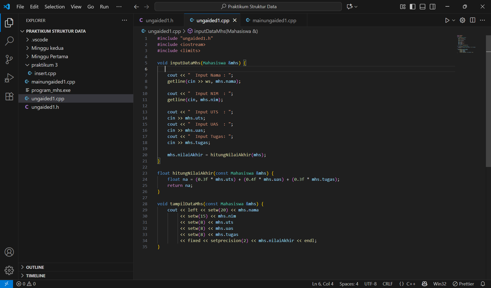

 <h1 align="center">Laporan Praktikum Modul 3&4 <br> ADT & SLL </h1>
<p align="center">Raden Aurel Aditya Kusumawaningyun - 103112430267</p>

## Dasar Teori Modul 3
Abstract Data Type (ADT) adalah landasan konseptual dalam pemrograman yang mendefinisikan suatu TYPE struktur data beserta serangkaian PRIMITIF atau operasi dasar yang dapat dilakukan terhadapnya. Konsepnya berfokus pada "apa" yang dilakukan oleh data dan bukan "bagaimana" ia diimplementasikan secara internal, menjadikannya definisi yang Statik. Abstract Data Type yang lengkap mencakup delapan kelompok primitif, mulai dari Konstruktor untuk membentuk nilai type baru, Selector untuk mengakses komponen, Destruktor atau Dealokator untuk membebaskan memori, hingga operator relasional dan aritmatika. Dalam praktikum ini, prinsip Information Hiding dari ADT diwujudkan dengan memisahkan implementasi menjadi dua modul utama yaitu Spesifikasi (.h) yang berisi deklarasi type dan prototipe fungsi, dan Realisasi (.c atau .cpp) yang berisi kode program aktual dari primitif-primitif tersebut.

## Dasar Teori Modul 4
Linked List merupakan salah satu struktur data dinamis yang sangat penting, direpresentasikan sebagai serangkaian elemen data yang saling berkait dan bersifat fleksibel karena dapat tumbuh atau mengerut sesuai kebutuhan memori. Dalam implementasinya, Linked List memanfaatkan Pointer untuk menghubungkan setiap elemen. Singly Linked List (SLL) adalah model paling sederhana yang hanya menggunakan satu arah pointer, memungkinkan pembacaan hanya ke arah maju. Setiap elemen atau node dalam SLL terdiri dari dua bagian yaitu Data dan Pointer next yang menunjuk ke alamat node berikutnya, di mana node terakhir akan menunjuk ke NULL atau Nil. Operasi dasar SLL, yang disebut primitif, mencakup CreateList atau inisialisasi, alokasi atau dealokasi memori, berbagai metode Insert seperti: First, Last, After, operasi Delete seperti: First, Last, After, dan View atau printInfo. Semua primitif ini diorganisir ke dalam file .h dan .cpp sesuai dengan kaidah ADT, memastikan pemisahan antara spesifikasi dan implementasi.

## Guided Modul 3

### soal 1
mahasiswa.h
```go
#ifndef MAHASISWA_H_ICLUDED
#define MAHASISWA_H_ICLUDED

struct mahasiswa
{
   char nim [10];
   int nilai1, nilai2; /* data */
};

void inputMhs(mahasiswa &m);
float rata2(mahasiswa m);
#endif

```
> 

mahasiswa.cpp
```go
#include "mahasiswa.h"
#include <iostream>
using namespace std;

void inputMhs(mahasiswa &m)
{
    cout << "input nama = ";
    cin >> (m).nim;
    cout << "input nilai = ";
    cin >> (m).nilai1;
    cout << "input nilai2 = ";
    cin >> (m).nilai2;
}
float rata2(mahasiswa m)
{
    return float(m.nilai1 + m.nilai2) /2;
}
```
> 

main.cpp
```go
#include <iostream>
#include "mahasiswa.h"
using namespace std;


int main()
{
    mahasiswa mhs;
    inputMhs(mhs);
    cout << "rata-rata = " << rata2(mhs);
    return 0;
}

```

> Output
> 
> Berikut SS VS Code dari Program Soal No 1

penjelasan singkat : 

Kode C++ ini mendemonstrasikan bagaimana konsep Abstract Data Type (ADT) diimplementasikan secara terstruktur untuk menerapkan prinsip Penyembunyian Informasi. Intinya, ADT mahasiswa dibagi menjadi tiga komponen file logis yaitu mahasiswa.h berfungsi sebagai kontrak ADT yang mendefinisikan struct dan mendeklarasikan prototipe juga fungsi-fungsi primitif seperti inputMhs, rata2, hanya menyatakan apa yang disediakan oleh ADT. mahasiswa.cpp menjadi badan yang menyediakan realisasi kode aktual dari primitif tersebut, menjelaskan bagaimana operasi input dan perhitungan dilakukan. Sementara itu, main.cpp bertindak sebagai program driver yang menggunakan ADT dengan hanya perlu menyertakan file .h dan memanggil fungsi secara langsung, tanpa perlu mengetahui detail implementasi di file .cpp, yang merupakan inti dari arsitektur modular yang bersih.


## Unguided Modul 3

### soal 1

Buat program yang dapat menyimpan data mahasiswa (max. 10) ke dalam sebuah array
dengan field nama, nim, uts, uas, tugas, dan nilai akhir. Nilai akhir diperoleh dari FUNGSI
dengan rumus 0.3*uts+0.4*uas+0.3*tugas.

ungaided1.h
```go
#ifndef MAHASISWA_H_INCLUDED
#define MAHASISWA_H_INCLUDED

#include <iostream>
#include <string>
#include <iomanip>

using namespace std;

struct Mahasiswa {
    string nama;
    string nim;
    int uts;
    int uas;
    int tugas;
    float nilaiAkhir;
};

const int MAX_MHS = 10;


void inputDataMhs(Mahasiswa &mhs);

float hitungNilaiAkhir(const Mahasiswa &mhs);

void tampilDataMhs(const Mahasiswa &mhs);

#endif 
```
> 

ungaided1.cpp
```go
#include "ungaided1.h"
#include <iostream>
#include <limits> 

void inputDataMhs(Mahasiswa &mhs) {
   
    cout << "  Input Nama : ";
    getline(cin >> ws, mhs.nama); 
    
    cout << "  Input NIM  : ";
    getline(cin, mhs.nim); 

    cout << "  Input UTS  : ";
    cin >> mhs.uts;
    cout << "  Input UAS  : ";
    cin >> mhs.uas;
    cout << "  Input Tugas: ";
    cin >> mhs.tugas;
    
    mhs.nilaiAkhir = hitungNilaiAkhir(mhs);
}

float hitungNilaiAkhir(const Mahasiswa &mhs) {
    float na = (0.3f * mhs.uts) + (0.4f * mhs.uas) + (0.3f * mhs.tugas);
    return na;
}

void tampilDataMhs(const Mahasiswa &mhs) {
    cout << left << setw(20) << mhs.nama 
         << setw(15) << mhs.nim
         << setw(8) << mhs.uts
         << setw(8) << mhs.uas
         << setw(8) << mhs.tugas
         << fixed << setprecision(2) << mhs.nilaiAkhir << endl;
}
```
> 

mainungaided1.cpp
```go
#include "ungaided1.h"
#include <limits> 

int main() {
    
    
    Mahasiswa daftarMhs[MAX_MHS];
    int jumlahMhs = 0;
    char lanjut;

    cout << "PROGRAM INPUT DAN NILAI AKHIR MAHASISWA" << endl;
   
    do {
        if (jumlahMhs >= MAX_MHS) {
            cout << "Batas maksimum mahasiswa (" << MAX_MHS << ") telah tercapai." << endl;
            break;
        }

        cout << "\n--- Input Mahasiswa Ke-" << jumlahMhs + 1 << " ---" << endl;
  
        inputDataMhs(daftarMhs[jumlahMhs]); 

        cin.ignore(numeric_limits<streamsize>::max(), '\n');
        jumlahMhs++;

        cout << "Lanjut input data? (yak/tidak): ";
        cin >> lanjut;
    
        cin.ignore(numeric_limits<streamsize>::max(), '\n'); 
        
    } while (lanjut == 'y' || lanjut == 'Y');

    cout << "DAFTAR NILAI AKHIR MAHASISWA (" << jumlahMhs << " dari " << MAX_MHS << ")" << endl;
    cout << left << setw(20) << "NAMA" 
         << setw(15) << "NIM"
         << setw(8) << "UTS"
         << setw(8) << "UAS"
         << setw(8) << "TUGAS"
         << "NILAI AKHIR" << endl;
    

    for (int i = 0; i < jumlahMhs; ++i) {
        tampilDataMhs(daftarMhs[i]); 
    }

    return 0;
}
```
> Output
> 
> > Berikut SS VS Code dari Program Soal No 1

penjelasan singkat : 

Kode C++ ini adalah demonstrasi sukses implementasi Abstract Data Type (ADT) untuk mengelola sekumpulan data mahasiswa dalam sebuah array. Intinya, kita coba memisahkan tanggung jawab kode secara ketat: Mahasiswa.h mendefinisikan type dan primitif, sementara Mahasiswa.cpp menyediakan realisasi fungsi seperti hitungNilaiAkhir (menggunakan rumus 0.3⋅UTS+0.4⋅UAS+0.3⋅Tugas). Program utama (main.cpp) berfungsi sebagai driver yang mengelola array dan loop input, dan yang terpenting, ia menyertakan mekanisme pembersihan input buffer (cin.ignore) secara strategis. Keberhasilan ini tidak hanya membuktikan implementasi rumus yang benar, tetapi juga menjamin keandalan user input campuran string dan numerik di dalam loop yang berkelanjutan, menghasilkan output tabel nilai yang terstruktur dan akurat.


### soal 2

Buatlah ADT pelajaran sebagai berikut di dalam file “pelajaran.h”:

> 


ungaided2.h
```go
#ifndef UNGAIDED2_H_INCLUDED 
#define UNGAIDED2_H_INCLUDED 

#include <iostream>
#include <string>

using namespace std;

struct pelajaran {
    string namaMapel;
    string kodeMapel;
};
 
pelajaran create_pelajaran(string namapel, string kodepel);

void tampil_pelajaran(const pelajaran& pel);

#endif 
```
> 

ungaided2.cpp
```go
#include "ungaided2.h" 
#include <iostream>

pelajaran create_pelajaran(string namapel, string kodepel) {
    pelajaran p;
    p.namaMapel = namapel;
    p.kodeMapel = kodepel;
    return p; 
}

void tampil_pelajaran(const pelajaran& pel) {
  
    cout << "nama pelajaran : " << pel.namaMapel << endl;
    cout << "nilai          : " << pel.kodeMapel << endl;
}
```
> 

mainungaided2.cpp
```go
#include "ungaided2.h" 
#include <limits> 


using namespace std;

int main() {
    
    string namapel = "struktur data";
    string kodepel = "STD";
    pelajaran pel = create_pelajaran(namapel, kodepel); 

    tampil_pelajaran(pel); 

    return 0;
}
```
> Output
> 
> > Berikut SS VS Code dari Program Soal No 2

penjelasan singkat : 

Kode C++ ini adalah implementasi murni dari Abstract Data Type (ADT) pelajaran, yang secara efisien mengelola type data terstruktur. Intinya, kode ini menggunakan fungsi konstruktor create_pelajaran untuk menugaskan pembuatan dan inisialisasi objek pelajaran baru. Dengan mendefinisikan function tersebut untuk menerima nama dan kode mapel lalu mengembalikannya sebagai objek utuh, proses ini menjamin bahwa setiap objek pelajaran selalu tercipta dalam kondisi valid, sesuai prinsip ADT. Seluruh proses ini diorganisasi dengan memisahkan Spesifikasi (.h) dan Realisasi (.cpp), memastikan penggunaan yang bersih dan modular melalui fungsi tampil_pelajaran pada driver utama.

### soal 3

Buatlah program dengan ketentuan :
- 2 buah array 2D integer berukuran 3x3 dan 2 buah pointer integer
- fungsi/prosedur yang menampilkan isi sebuah array integer 2D
- fungsi/prosedur yang akan menukarkan isi dari 2 array integer 2D pada posisi tertentu
STRUKTUR DATA 35
- fungsi/prosedur yang akan menukarkan isi dari variabel yang ditunjuk oleh 2 buah
pointer

ungaided3.h
```go
#ifndef UNGAIDED3_H_INCLUDED
#define UNGAIDED3_H_INCLUDED

#include <iostream>
#include <string>
#include <iomanip>

using namespace std;

const int SIZE = 3;

void tampilkanArray(const int arr[][SIZE], const string& nama);
void tukarIsiArray(int arrA[][SIZE], int arrB[][SIZE], int baris, int kolom);
void tukarNilaiPointer(int *ptr1, int *ptr2);

#endif 
```
> 

ungaided3.cpp
```go
#include "ungaided3.h"

void tampilkanArray(const int arr[][SIZE], const string& nama) {
    cout << "\nIsi Array " << nama << " (" << SIZE << "x" << SIZE << "):" << endl;
    for (int i = 0; i < SIZE; ++i) {
        for (int j = 0; j < SIZE; ++j) {
            cout << setw(5) << arr[i][j];
        }
        cout << endl;
    }
}

void tukarIsiArray(int arrA[][SIZE], int arrB[][SIZE], int baris, int kolom) {
    if (baris >= 0 && baris < SIZE && kolom >= 0 && kolom < SIZE) {
        int temp = arrA[baris][kolom];
        arrA[baris][kolom] = arrB[baris][kolom];
        arrB[baris][kolom] = temp;
        cout << "\nOperasi: Berhasil menukar elemen pada posisi [" << baris << "][" << kolom << "]." << endl;
    } else {
        cout << "\nError: Posisi indeks tidak valid." << endl;
    }
}

void tukarNilaiPointer(int *ptr1, int *ptr2) {
    int temp = *ptr1;
    *ptr1 = *ptr2;
    *ptr2 = temp;
}
```
> 

mainungaided3.cpp
```go
##include "ungaided3.h"

int main() {

    int array1[SIZE][SIZE] = {
        {10, 20, 30},
        {40, 50, 60},
        {70, 80, 90}
    };
    
    int array2[SIZE][SIZE] = {
        {11, 22, 33},
        {44, 55, 66},
        {77, 88, 99}
    };

    int valA = 100;
    int valB = 200;

    int *ptrA = &valA;
    int *ptrB = &valB;

  
    cout << "DEMONSTRASI ARRAY 2D, POINTER, DAN FUNGSI SWAP" << endl;
    
    tampilkanArray(array1, "Array 1 (Awal)");
    tampilkanArray(array2, "Array 2 (Awal)");

    tukarIsiArray(array1, array2, 1, 1); 

    tampilkanArray(array1, "Array 1 (Setelah Tukar)");
    tampilkanArray(array2, "Array 2 (Setelah Tukar)");
    
    
    cout << "DEMONSTRASI TUKAR NILAI VIA POINTER (Call by Reference)" << endl;
  

    cout << "Nilai Awal (valA=" << valA << ", valB=" << valB << ")" << endl;
    cout << "Nilai yang ditunjuk: *ptrA=" << *ptrA << ", *ptrB=" << *ptrB << endl;

    tukarNilaiPointer(ptrA, ptrB);

    cout << "\nOperasi: tukarNilaiPointer(ptrA, ptrB) dieksekusi..." << endl;
    
    cout << "Nilai Akhir (valA=" << valA << ", valB=" << valB << ")" << endl;
    cout << "Nilai yang ditunjuk: *ptrA=" << *ptrA << ", *ptrB=" << *ptrB << endl;

    return 0;
}
```
> Output
> 
> > Berikut SS VS Code dari Program Soal No 3

> Output
> 
> > Berikut SS terminal Ungaided3

penjelasan singkat : 

Kode C++ ini adalah demonstrasi fungsional dari manipulasi Array 2D dan Pointer, menekankan pada konsep Call by Reference untuk operasi pertukaran data. Intinya, fungsi tukarIsiArray memungkinkan modifikasi langsung pada elemen array (array1 dan array2) pada posisi tertentu karena array secara alami dilewatkan sebagai referensi, menjamin perubahan elemen bersifat permanen. Sementara itu, fungsi tukarNilaiPointer menunjukkan esensi dari Pemanggilan dengan Pointer: ia menerima alamat memori dua variabel (valA dan valB) dan menggunakan operator Dereference (*) untuk mengakses dan menukar nilai yang tersimpan di lokasi memori asli tersebut. Hasilnya, pertukaran data pada array dan pertukaran nilai valA dan valB melalui pointer berhasil dilakukan secara permanen di luar fungsi utama.


## Guided Modul 4

### soal 1

```go
#include <iostream>
using namespace std;

// Struktur Node
struct Node {
    int data;
    Node* next;
};
Node* head = nullptr;

// Fungsi untuk membuat node baru
Node* createNode(int data) {
    Node* newNode = new Node();
    newNode->data = data;
    newNode->next = nullptr;
    return newNode;
}

// ========== INSERT DEPAN FUNCTION (Penambahan) ==========
void insertDepan(int data) {
    Node* newNode = createNode(data);
    // Logika Insert First: Node baru menunjuk ke head lama, lalu head menunjuk ke Node baru.
    newNode->next = head;
    head = newNode;
    cout << "Data " << data << " berhasil ditambahkan di depan.\n";
}

void insertBelakang(int data) {
    Node* newNode = createNode(data);
    if (head == nullptr) {
        head = newNode;
    } else {
        Node* temp = head;
        while (temp->next != nullptr) {
            temp = temp->next;
        }
        temp->next = newNode;
    }
    cout << "Data " << data << " berhasil ditambahkan di belakang.\n";
}

void insertSetelah(int target, int dataBaru) {
    Node* temp = head;
    while (temp != nullptr && temp->data != target) {
        temp = temp->next;
    }

    if (temp == nullptr) {
        cout << "Data " << target << " tidak ditemukan!\n";
    } else {
        Node* newNode = createNode(dataBaru);
        // Logika Insert After: Sambungkan newNode ke temp->next, lalu temp ke newNode
        newNode->next = temp->next;
        temp->next = newNode;
        cout << "Data " << dataBaru << " berhasil disisipkan setelah " << target << ".\n";
    }
}

// ========== DELETE FUNCTION ==========
void hapusNode(int data) {
    if (head == nullptr) {
        cout << "List kosong!\n";
        return;
    }

    Node* temp = head;
    Node* prev = nullptr;

    // Jika data di node pertama (Delete First)
    if (temp != nullptr && temp->data == data) {
        head = temp->next;
        delete temp;
        cout << "Data " << data << " berhasil dihapus.\n";
        return;
    }

    // Cari node yang akan dihapus
    while (temp != nullptr && temp->data != data) {
        prev = temp;
        temp = temp->next;
    }

    // Jika data tidak ditemukan
    if (temp == nullptr) {
        cout << "Data " << data << " tidak ditemukan!\n";
        return;
    }

    // Putuskan tautan: prev melompati temp
    prev->next = temp->next;
    delete temp;
    cout << "Data " << data << " berhasil dihapus.\n";
}

// ========== UPDATE FUNCTION ==========
void updateNode(int dataLama, int dataBaru) {
    Node* temp = head;
    while (temp != nullptr && temp->data != dataLama) {
        temp = temp->next;
    }

    if (temp == nullptr) {
        cout << "Data " << dataLama << " tidak ditemukan!\n";
    } else {
        temp->data = dataBaru;
        cout << "Data " << dataLama << " berhasil diupdate menjadi " << dataBaru << ".\n";
    }
}

// ========== DISPLAY FUNCTION ==========
void tampilkanList() {
    if (head == nullptr) {
        cout << "List kosong!\n";
        return;
    }

    Node* temp = head;
    cout << "Isi Linked List: ";
    while (temp != nullptr) {
        cout << temp->data << " -> ";
        temp = temp->next;
    }
    cout << "NULL\n";
}

// ========== MAIN PROGRAM ==========
int main() {
    int pilihan, data, target, dataBaru;

    do {
        cout << "\n=== MENU SINGLE LINKED LIST ===\n";
        cout << "1. Insert Depan\n";
        cout << "2. Insert Belakang\n";
        cout << "3. Insert Setelah\n";
        cout << "4. Hapus Data\n";
        cout << "5. Update Data\n";
        cout << "6. Tampilkan List\n";
        cout << "0. Keluar\n";
        cout << "Pilih: ";
        if (!(cin >> pilihan)) {
            // Menangani input non-integer
            cin.clear(); 
            cin.ignore(10000, '\n');
            pilihan = -1; // Set pilihan ke nilai default
        }

        switch (pilihan) {
            case 1:
                cout << "Masukkan data: ";
                cin >> data;
                insertDepan(data); 
                break;
            case 2:
                cout << "Masukkan data: ";
                cin >> data;
                insertBelakang(data);
                break;
            case 3:
                cout << "Masukkan data target: ";
                cin >> target;
                cout << "Masukkan data baru: ";
                cin >> dataBaru;
                insertSetelah(target, dataBaru);
                break;
            case 4:
                cout << "Masukkan data yang ingin dihapus: ";
                cin >> data;
                hapusNode(data);
                break;
            case 5:
                cout << "Masukkan data lama: ";
                cin >> data;
                cout << "Masukkan data baru: ";
                cin >> dataBaru;
                updateNode(data, dataBaru);
                break;
            case 6:
                tampilkanList();
                break;
            case 0:
                cout << "Program selesai.\n";
                break;
            default:
                cout << "Pilihan tidak valid!\n";
        }
    } while (pilihan != 0);

    return 0;
}

```


> Output
> 
> Berikut SS VS Code dari Program Soal No 1

penjelasan: 

Kode ini adalah implementasi dasar dari Abstract Data Type (ADT) Single Linked List dalam C++, di mana semua operasi seperti: Insersi, Deletion, Update, dan Display yang dikelola melalui pointer utama head. Kode ini membangun SLL yang elemennya atau Node terstruktur dengan dua bagian yaitu data nilai integer yang disimpan dan next pointer ke Node berikutnya. Pointer global head berfungsi sebagai First(L), yaitu penunjuk ke Node pertama dalam List.

1. Struktur dan Inisialisasi
Pada bagian awal, struct Node mendefinisikan bentuk setiap elemen, dan pointer head diinisialisasi ke nullptr, menandakan bahwa List dalam kondisi kosong. Fungsi createNode int data adalah Constructor yang tugasnya mengalokasikan memori baru new Node() untuk Node baru dan mengisi data serta mengatur pointer next Node tersebut ke nullptr sebelum disisipkan.

2. Operasi Penyisipan (Insertion)
Operasi penyisipan termasuk insertDepan, insertBelakang, insertSetelah adalah yang paling krusial karena ia memanipulasi pointer next untuk menghubungkan Node baru:

insertDepan: Menerapkan logika Insert First (O(1)). Node baru dibuat, pointer next Node baru disetel untuk menunjuk ke head lama, kemudian pointer head digeser untuk menunjuk ke Node baru.

insertBelakang: Menerapkan logika Insert Last (O(N)). Karena ini SLL, fungsi harus melakukan traversal (while (temp->next != nullptr)) dari head hingga Node terakhir (temp) ditemukan. Node baru kemudian disambungkan setelah Node terakhir tersebut.

insertSetelah: Menerapkan logika Insert After (O(1) setelah ditemukan). Fungsi mencari Node target. Setelah ditemukan (temp), Node baru disisipkan di antara temp dan temp->next dengan dua langkah kritis: newNode->next = temp->next; dan temp->next = newNode;.

3. Operasi Penghapusan dan Pembaruan (Deletion & Update)
hapusNode merupakan prosedur yang menangani penghapusan dengan mencari Node yang akan dihapus (temp) dan Node pendahulunya (prev) secara bersamaan. Logika utamanya dibagi tiga yaitu Hapus Awal (menggeser head), Hapus Tengah/Akhir (menggunakan prev->next = temp->next; untuk melompati temp), dan diakhiri dengan membebaskan memori Node yang dihapus (delete temp).

updateNode merupakan operasi yang paling sederhana di SLL (O(N)). Fungsi hanya perlu melakukan Sequential Search untuk menemukan Node dengan dataLama, dan jika ditemukan, hanya nilai temp->data yang diperbarui menjadi dataBaru, tanpa perlu menyentuh pointer.

4. Tampilan dan Program Utama
tampilkanList merupakan Fungsi yang melakukan traversal dari head hingga akhir List (while (temp != nullptr)), mencetak nilai setiap Node secara berurutan dan diakhiri dengan penanda NULL.

main() memilik bagian fungsi sebagai Driver program, menampilkan menu, menerima input dari pengguna, dan memanggil fungsi-fungsi SLL di atas berdasarkan pilihan yang diberikan

## Unguided Modul 4

### soal 1

buatlah single linked list untuk Antrian yang menyimpan data pembeli( nama dan pesanan). program memiliki beberapa menu seperti tambah antrian,  layani antrian(hapus), dan tampilkan antrian. \*antrian pertama harus yang pertama dilayani
   

```go
#include <iostream>
#include <string>

using namespace std;

struct Node {
    string nama;
    string pesanan;
    Node* next;
};

Node* depan = nullptr; 
Node* belakang = nullptr; 

Node* MNode(string nama, string pesanan) {
    Node* newNode = new Node();
    newNode->nama = nama;
    newNode->pesanan = pesanan;
    newNode->next = nullptr;
    return newNode;
}

void tambahAntrian(string nama, string pesanan) {
    Node* newNode = MNode(nama, pesanan);

    if (depan == nullptr) {
        depan = newNode;
        belakang = newNode;
    } else {
        belakang->next = newNode;
        belakang = newNode;
    }
    cout << "\n Antrian berhasil ditambahkan: " << nama << " memesan " << pesanan << ".\n";
}

void layaniAntrian() {
    if (depan == nullptr) {
        cout << "\n Antrian kosong gais! belum ada pembeli yang bisa dilayani.\n";
        return;
    }

    Node* nodeDilayani = depan;
    string namaDilayani = nodeDilayani->nama;

    depan = depan->next;

    if (depan == nullptr) {
        belakang = nullptr;
    }

    delete nodeDilayani;
    
    cout << "\n Pembeli " << namaDilayani << " telah selesai dilayani.\n";
}

void tampilkanAntrian() {
    if (depan == nullptr) {
        cout << "\nList antrian kosong.\n";
        return;
    }

    Node* current = depan;
    int nomor = 1;
    cout << "\n=== DAFTAR ANTRIAN PEMBELI ===\n";
    while (current != nullptr) {
        cout << nomor << ". Nama: " << current->nama 
             << ", Pesanan: " << current->pesanan << endl;
        current = current->next;
        nomor++;
    }
    cout << "==============================\n";
}

int main() {
    int pilihan;
    string namaPembeli, pesananPembeli;

    do {
        cout << "\n\n=== MENU ANTRIAN ===\n";
        cout << "1. Tambah Antrian \n";
        cout << "2. Layani Antrian \n";
        cout << "3. Tampilkan Antrian\n";
        cout << "0. Keluar\n";
        cout << "Pilih: ";
        if (!(cin >> pilihan)) {
             cin.clear(); 
             cin.ignore(10000, '\n');
             pilihan = -1;
        }

        switch (pilihan) {
            case 1:
                cout << "Masukkan Nama Pembeli: ";
                cin.ignore(); 
                getline(cin, namaPembeli);
                cout << "Masukkan Jenis Pesanan: ";
                getline(cin, pesananPembeli);
                tambahAntrian(namaPembeli, pesananPembeli);
                break;
            case 2:
                layaniAntrian();
                break;
            case 3:
                tampilkanAntrian();
                break;
            case 0:
                cout << "Program selesai. Terima kasih.\n";
                break;
            default:
                cout << "Pilihan tidak valid!\n";
        }
    } while (pilihan != 0);

    return 0;
}


```


> Output
> 
> Berikut SS VS Code dari Program Soal No 1

penjelasan: 

Kode C++ ini adalah demonstrasi fungsional dari implementasi Abstract Data Type (ADT) Queue yang dibangun di atas struktur Single Linked List, menekankan pada prinsip FIFO (First-In, First-Out). Implementasi ini dioptimalkan untuk efisiensi operasional dengan menggunakan dua pointer global, depan dan belakang.

Fungsi tambahAntrian mewakili operasi Insert Last yang dioptimalkan, menjamin kompleksitas waktu O(1). Optimalisasi ini dicapai dengan memanfaatkan pointer belakang untuk menyisipkan Node baru setelah elemen terakhir, tanpa perlu traversal yang mahal (O(N)). Sebaliknya, fungsi layaniAntrian mewakili operasi Delete First, yang juga memiliki kompleksitas O(1), di mana ia memodifikasi pointer depan untuk menunjuk ke Node berikutnya, menjamin bahwa elemen yang pertama masuk adalah yang pertama dihapus.

Struktur utama, struct Node, dirancang untuk menyimpan data komposit yaitu nama dan pesanan, sementara logika di dalam layaniAntrian secara ketat mengurus pemutusan tautan Node yang dilayani dan pembebasan memori delete nodeDilayani, menjaga integritas List dan mencegah memory leak. Hasilnya, program ini berhasil memodelkan sistem antrian yang efisien dan fungsional, memanfaatkan kekuatan manipulasi pointer SLL untuk operasi Insert dan Delete yang cepat.

### soal 2
buatlah program kode untuk membalik (reverse) singly linked list (1-2-3 menjadi 3-2-1) 
   
```go
#include <iostream>

using namespace std;

struct Node {
    int data;
    Node* berikutnya; 
};

Node* head = nullptr; 

Node* buatNode(int nilaiData) {
    Node* nodeBaru = new Node();
    nodeBaru->data = nilaiData;
    nodeBaru->berikutnya = nullptr;
    return nodeBaru;
}

void sisipAkhir(int nilaiData) {
    Node* nodeBaru = buatNode(nilaiData);
    if ( head == nullptr) {
        head = nodeBaru;
    } else {
        Node* sementara = head;
        while (sementara->berikutnya != nullptr) {
            sementara = sementara->berikutnya;
        }
        sementara->berikutnya = nodeBaru;
    }
}

void cetakList() {
    Node* sementara = head;
    if (sementara == nullptr) {
        cout << "List kosong.\n";
        return;
    }
    while (sementara != nullptr) {
        cout << sementara->data;
        if (sementara->berikutnya != nullptr) {
            cout << " -> ";
        }
        sementara = sementara->berikutnya;
    }
    cout << "\n";
}

void balikList() {
   
    Node* sebelum = nullptr;
    
    Node* saatIni = head;
    
    Node* berikut = nullptr;

    
    while (saatIni != nullptr) {
      
        berikut = saatIni->berikutnya;

        saatIni->berikutnya = sebelum;

        sebelum = saatIni; 
        saatIni = berikut; 
    }

    head = sebelum;
  
}


int main() {

    sisipAkhir(1);
    sisipAkhir(2);
    sisipAkhir(3);


    cout << "List Awal: ";
    cetakList(); 

    balikList();

    cout << "List Setelah Dibalik: ";
    cetakList();

    return 0;
}
```


> Output
> 
> Berikut SS VS Code dari Program Soal No 2

penjelasan: 

Kode C++ ini adalah demonstrasi fungsional dari implementasi algoritma Iterative Reversal pada Single Linked List, menekankan pada modifikasi tautan pointer secara langsung untuk membalik urutan List secara permanen. Intinya, fungsi balikList mencapai pembalikan ini dengan memanipulasi tiga pointer yang bergerak secara berkoordinasi. saatIni yaitu Node yang diproses, sebelum yaitu Node yang sudah dibalik dan menjadi destinasi tautan baru, dan berikut yaitu penjaga tautan maju. Dengan mengubah arah saatIni->berikutnya agar menunjuk ke sebelum di setiap langkah, tautan List diputus dan dibalik satu per satu. Hasilnya, List yang semula terurut (1→2→3) berhasil dibalik menjadi urutan terbalik (3→2→1), di mana pointer kepala List baru secara permanen disetel ke Node terakhir dari List lama.


## Referensi
Carrano, F. M., & Prichard, J. (2018). Data abstraction & problem solving with C++: Walls and mirrors (7th ed.). Pearson Education.

Goodrich, M. T., Tamassia, R., & Mount, D. M. (2011). Data structures and algorithms in C++. John Wiley & Sons.ny.

Telkom University. (n.d.). Modul 3 & 4 Abstract Data Type & SIngle Linked List. Fakultas Informatika.

The C++ Resources Network. (n.d.). C++ Tutorials. Retrieved October 10, 2025, from https://www.cplusplus.com/doc/tutorial/

The C++ Standard Library. (n.d.). C++ reference. Retrieved October 10, 2025, from https://en.cppreference.com/w/cpp/

Microsoft. (n.d.). struct (C++). Microsoft Learn. Retrieved October 10, 2025, from https://learn.microsoft.com/en-us/cpp/cpp/struct-cpp

