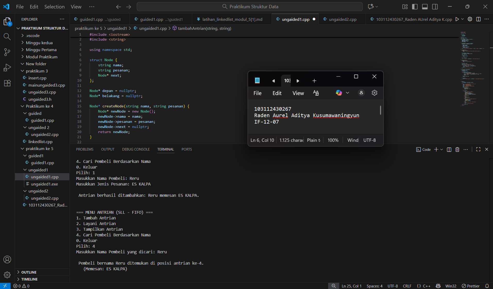
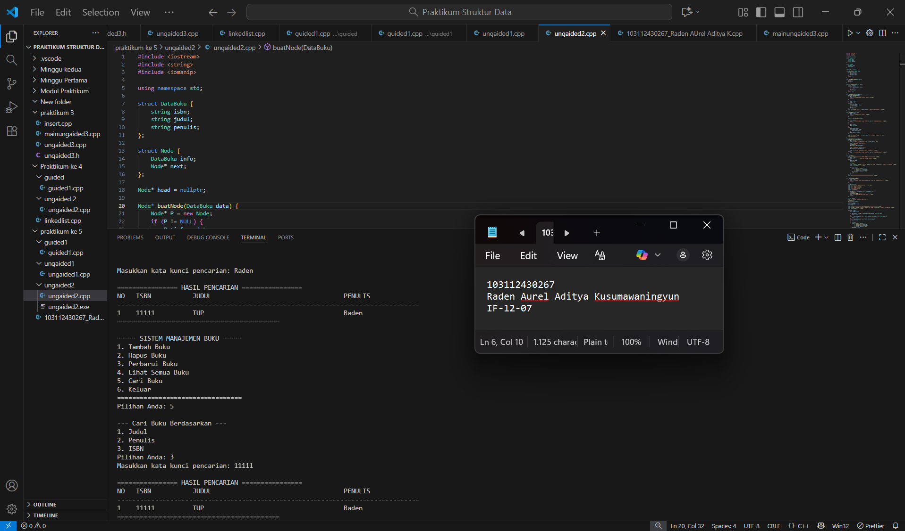

<h1 align="center">Laporan Praktikum Modul 5 <br> SLL Searching </h1>
<p align="center">Raden Aurel Aditya Kusumawaningyun - 103112430267</p>

## Dasar Teori Modul 5
Operasi Pencarian Searching pada Singly Linked List. Dalam konteks struktur data dinamis. Searching merupakan salah satu operasi primitif atau operasi dasar yang esensial pada Linked List. Konsep ini berfokus pada aktivitas menemukan sebuah node tertentu di dalam list. Berbeda dengan Array yang dapat mengakses data secara langsung menggunakan indeks, Linked List harus menggunakan metode pencarian linier. Proses pencarian ini berjalan dengan mengunjungi setiap node secara berurutan, dimulai dari node pertama, dan berhenti seketika node yang dicari ditemukan. Keberhasilan operasi searching ini menjadi fondasi penting yang mempermudah implementasi operasi lanjutan yang lebih kompleks, seperti Insert After, Delete After, atau Update data. Secara konseptual, operasi searching ini adalah bagian dari Abstract Data Type (ADT) dari Linked List, di mana ADT sendiri adalah landasan yang mendefinisikan suatu tipe struktur data beserta serangkaian operasi primitif yang dapat dilakukan terhadapnya

Dalam implementasi praktis C++, struktur data ini memanfaatkan pointer operator-operator. Ketika pencarian dilakukan, sebuah pointer sementara (temp) akan disiapkan untuk memulai dari head dan bergerak maju melalui tautan (temp = temp->next) hingga node terakhir (nullptr), sambil membandingkan nilai info pada node saat ini dengan nilai key yang dicari. Pemahaman yang kuat terhadap logika searching ini, yang merupakan salah satu dari berbagai operasi yang dibahas dalam literatur seperti "C++ Primer" atau modul struktur data universitas, sangat krusial untuk menguasai pengelolaan memori dan struktur data dinamis secara keseluruhan.

## Guided Modul 5

### soal 1

```go
#include <iostream>
using namespace std;

// Struktur Node
struct Node {
    int data;
    Node* next;
};
Node* head = nullptr;

// Fungsi untuk membuat node baru
Node* createNode(int data) {
    Node* newNode = new Node();
    newNode->data = data;
    newNode->next = nullptr;
    return newNode;
}

// ========== INSERT DEPAN FUNCTION (Penambahan) ==========
void insertDepan(int data) {
    Node* newNode = createNode(data);
    // Logika Insert First: Node baru menunjuk ke head lama, lalu head menunjuk ke Node baru.
    newNode->next = head;
    head = newNode;
    cout << "Data " << data << " berhasil ditambahkan di depan.\n";
}

void insertBelakang(int data) {
    Node* newNode = createNode(data);
    if (head == nullptr) {
        head = newNode;
    } else {
        Node* temp = head;
        while (temp->next != nullptr) {
            temp = temp->next;
        }
        temp->next = newNode;
    }
    cout << "Data " << data << " berhasil ditambahkan di belakang.\n";
}

void insertSetelah(int target, int dataBaru) {
    Node* temp = head;
    while (temp != nullptr && temp->data != target) {
        temp = temp->next;
    }

    if (temp == nullptr) {
        cout << "Data " << target << " tidak ditemukan!\n";
    } else {
        Node* newNode = createNode(dataBaru);
        // Logika Insert After: Sambungkan newNode ke temp->next, lalu temp ke newNode
        newNode->next = temp->next;
        temp->next = newNode;
        cout << "Data " << dataBaru << " berhasil disisipkan setelah " << target << ".\n";
    }
}

// ========== DELETE FUNCTION ==========
void hapusNode(int data) {
    if (head == nullptr) {
        cout << "List kosong!\n";
        return;
    }

    Node* temp = head;
    Node* prev = nullptr;

    // Jika data di node pertama (Delete First)
    if (temp != nullptr && temp->data == data) {
        head = temp->next;
        delete temp;
        cout << "Data " << data << " berhasil dihapus.\n";
        return;
    }

    // Cari node yang akan dihapus
    while (temp != nullptr && temp->data != data) {
        prev = temp;
        temp = temp->next;
    }

    // Jika data tidak ditemukan
    if (temp == nullptr) {
        cout << "Data " << data << " tidak ditemukan!\n";
        return;
    }

    // Putuskan tautan: prev melompati temp
    prev->next = temp->next;
    delete temp;
    cout << "Data " << data << " berhasil dihapus.\n";
}

// ========== UPDATE FUNCTION ==========
void updateNode(int dataLama, int dataBaru) {
    Node* temp = head;
    while (temp != nullptr && temp->data != dataLama) {
        temp = temp->next;
    }

    if (temp == nullptr) {
        cout << "Data " << dataLama << " tidak ditemukan!\n";
    } else {
        temp->data = dataBaru;
        cout << "Data " << dataLama << " berhasil diupdate menjadi " << dataBaru << ".\n";
    }
}

// ========== SEARCH FUNCTION  ==========
void searchData(int key) {
    Node *temp = head;
    int pos = 1;
    bool found = false;

    while (temp != nullptr) {
        // Cek apakah data di node saat ini sama dengan key
        if (temp->data == key) {
            cout << "Data " << key << " ditemukan pada posisi ke-" << pos << endl;
            found = true;
            break; // Hentikan perulangan jika sudah ditemukan
        }
        temp = temp->next; // Geser ke node berikutnya
        pos++;             // Tambah posisi
    }

    // PENTING: Menggunakan 'if (!found)' untuk mengoreksi kesalahan logika asli
    if (!found) { 
        cout << "Data " << key << " tidak ditemukan dalam linked list.\n";
    }
}


// ========== DISPLAY FUNCTION ==========
void tampilkanList() {
    if (head == nullptr) {
        cout << "List kosong!\n";
        return;
    }

    Node* temp = head;
    cout << "Isi Linked List: ";
    while (temp != nullptr) {
        cout << temp->data << " -> ";
        temp = temp->next;
    }
    cout << "NULL\n";
}


// ========== MAIN PROGRAM ==========
int main() {
    int pilihan, data, target, dataBaru;

    do {
        cout << "\n=== MENU SINGLE LINKED LIST ===\n";
        cout << "1. Insert Depan\n";
        cout << "2. Insert Belakang\n";
        cout << "3. Insert Setelah\n";
        cout << "4. Hapus Data\n";
        cout << "5. Update Data\n";
        cout << "6. Tampilkan List\n";
        cout << "7. Cari Data\n"; 
        cout << "0. Keluar\n";
        cout << "Pilih: ";
        if (!(cin >> pilihan)) {
            // Menangani input non-integer
            cin.clear(); 
            cin.ignore(10000, '\n');
            pilihan = -1; // Set pilihan ke nilai default
        }

        switch (pilihan) {
            case 1:
                cout << "Masukkan data: ";
                cin >> data;
                insertDepan(data); 
                break;
            case 2:
                cout << "Masukkan data: ";
                cin >> data;
                insertBelakang(data);
                break;
            case 3:
                cout << "Masukkan data target: ";
                cin >> target;
                cout << "Masukkan data baru: ";
                cin >> dataBaru;
                insertSetelah(target, dataBaru);
                break;
            case 4:
                cout << "Masukkan data yang ingin dihapus: ";
                cin >> data;
                hapusNode(data);
                break;
            case 5:
                cout << "Masukkan data lama: ";
                cin >> data;
                cout << "Masukkan data baru: ";
                cin >> dataBaru;
                updateNode(data, dataBaru);
                break;
            case 6:
                tampilkanList();
                break;
            case 7: // Case baru untuk Search
                cout << "Masukkan data yang dicari (key): ";
                cin >> data;
                searchData(data);
                break;
            case 0:
                cout << "Program selesai.\n";
                break;
            default:
                cout << "Pilihan tidak valid!\n";
        }
    } while (pilihan != 0);

    return 0;
}

```


> Output
> 
> Berikut SS VS Code dari Program Soal No 1

penjelasan: 

Langkah-Langkah Proses Pencarian
1. Inisialisasi dan Looping: Pencarian dimulai dengan mengarahkan pointer temp ke head dan memulai perulangan while (temp != nullptr). Perulangan ini memastikan bahwa proses pencarian terus berjalan selama list belum mencapai akhir (nullptr).

2. Pengecekan dan Modifikasi Flag:
Di setiap node, program mengecek kondisi if (temp->data == key). Jika kondisi ini benar maka data ditemukan, program mencetak posisi (pos), mengubah flag found menjadi true, dan segera menghentikan perulangan dengan perintah break.

3. Pergeseran dan Penghitungan: Jika data tidak ditemukan, pointer temp digeser ke node berikutnya melalui temp = temp->next;, dan counter pos ditingkatkan (pos++).

4. Output Hasil Akhir: Setelah perulangan selesai, program mengecek flag if (!found) (yaitu, jika found masih false). Pengecekan ini menjamin bahwa pesan "data tidak ditemukan" hanya ditampilkan setelah seluruh Linked List dilalui tanpa menemukan nilai yang dicari.

Kesimpulan: Fungsi ini mendemonstrasikan metode pencarian linier pada Linked List. Dengan menggunakan flag found dan pointer temp, program dapat secara efisien mencari data dan membedakan antara keberhasilan (menggunakan break) dan kegagalan pencarian.

## Ungaided Modul 5

### soal 1

buatlah searcing untuk mencari nama pembeli pada unguided sebelumnya

```go
#include <iostream>
#include <string>

using namespace std;

struct Node {
    string nama;
    string pesanan;
    Node* next;
};

Node* depan = nullptr; 
Node* belakang = nullptr; 

Node* createNode(string nama, string pesanan) {
    Node* newNode = new Node();
    newNode->nama = nama;
    newNode->pesanan = pesanan;
    newNode->next = nullptr;
    return newNode;
}

void tambahAntrian(string nama, string pesanan) {
    Node* newNode = createNode(nama, pesanan);

    if (depan == nullptr) {
        depan = newNode;
        belakang = newNode;
    } else {
        belakang->next = newNode;
        belakang = newNode;
    }
    cout << "\n Antrian berhasil ditambahkan: " << nama << " memesan " << pesanan << ".\n";
}

void layaniAntrian() {
    if (depan == nullptr) {
        cout << "\n Antrian kosong! Tidak ada pembeli yang bisa dilayani.\n";
        return;
    }

    Node* nodeDilayani = depan;
    string namaDilayani = nodeDilayani->nama;

    depan = depan->next;

    if (depan == nullptr) {
        belakang = nullptr;
    }

    delete nodeDilayani;
    
    cout << "\n Pembeli " << namaDilayani << " telah selesai dilayani.\n";
}

void tampilkanAntrian() {
    if (depan == nullptr) {
        cout << "\nList antrian kosong.\n";
        return;
    }

    Node* current = depan;
    int nomor = 1;
    cout << "\n=== DAFTAR ANTRIAN PEMBELI ===\n";
    while (current != nullptr) {
        cout << nomor << ". Nama: " << current->nama 
             << ", Pesanan: " << current->pesanan << endl;
        current = current->next;
        nomor++;
    }
    cout << "==============================\n";
}

void cariPembeli(string targetNama) {
    Node* current = depan;
    int posisi = 1;
    bool ditemukan = false;

    while (current != nullptr) {
        if (current->nama == targetNama) {
            cout << "\n Pembeli bernama " << targetNama 
                 << " ditemukan di posisi antrian ke-" << posisi << "." << endl;
            cout << "   (Memesan: " << current->pesanan << ")" << endl;
            ditemukan = true;
            break; 
        }
        current = current->next; 
        posisi++; 
    }

    if (!ditemukan) {
        cout << "\n Pembeli bernama " << targetNama << " tidak ditemukan dalam antrian.\n";
    }
}


int main() {
    int pilihan;
    string namaPembeli, pesananPembeli, namaCari;

    do {
        cout << "\n\n=== MENU ANTRIAN (SLL - FIFO) ===\n";
        cout << "1. Tambah Antrian \n";
        cout << "2. Layani Antrian \n";
        cout << "3. Tampilkan Antrian\n";
        cout << "4. Cari Pembeli Berdasarkan Nama\n"; 
        cout << "0. Keluar\n";
        cout << "Pilih: ";
        if (!(cin >> pilihan)) {
             cin.clear(); 
             cin.ignore(10000, '\n');
             pilihan = -1;
        }

        switch (pilihan) {
            case 1:
                cout << "Masukkan Nama Pembeli: ";
                cin.ignore(); 
                getline(cin, namaPembeli);
                cout << "Masukkan Jenis Pesanan: ";
                getline(cin, pesananPembeli);
                tambahAntrian(namaPembeli, pesananPembeli);
                break;
            case 2:
                layaniAntrian();
                break;
            case 3:
                tampilkanAntrian();
                break;
            case 4: 
                cout << "Masukkan Nama Pembeli yang dicari: ";
                cin.ignore();
                getline(cin, namaCari);
                cariPembeli(namaCari);
                break;
            case 0:
                cout << "Program selesai. Terima kasih.\n";
                break;
            default:
                cout << "Pilihan tidak valid!\n";
        }
    } while (pilihan != 0);

    return 0;
}

```


> Output
> 
> Berikut SS VS Code dari Program Soal No 1

penjelasan: 

Kode C++ ini merupakan implementasi fungsional dari Abstract Data Type  Queue yang direalisasikan menggunakan struktur Single Linked List atau SLL, di mana prinsip First-In, First-Out (FIFO) diterapkan secara ketat. Intinya, efisiensi operasional sistem antrian ini dicapai melalui penggunaan pointer depan dan belakang. Fungsi tambahAntrian dioptimalkan menjadi O(1) karena menggunakan pointer belakang untuk menyisipkan Node baru tanpa traversal yang lama. Demikian pula, fungsi layaniAntrian adalah operasi Delete First O(1) yang hanya memanipulasi pointer depan untuk memutuskan Node yang pertama masuk. Sementara itu, fungsi cariPembeli mengimplementasikan Sequential Search untuk melintasi List, menjamin fungsionalitas penuh manajemen antrian, di mana semua operasi kritis dilakukan dengan memanipulasi alamat memori secara langsung.

### soal 2

gunakan latihan pada pertemuan minggun ini dan tambahkan seardhing untuk mencari buku berdasarkan judul, penulis, dan ISBN

```go
#include <iostream>
#include <string>
#include <iomanip> 

using namespace std;

struct DataBuku {
    string isbn;
    string judul;
    string penulis;
};

struct Node {
    DataBuku info; 
    Node* next;    
};

Node* head = nullptr; 

Node* buatNode(DataBuku data) {
    Node* P = new Node;
    if (P != NULL) {
        P->info = data; 
        P->next = NULL;
    }
    return P;
}

void hapusMemoriNode(Node* &P) {
    delete P;
    P = NULL;
}

Node* cariBukuByISBN(string isbn) {
    Node* P = head;
    while (P != NULL) {
        if (P->info.isbn == isbn) {
            return P;
        }
        P = P->next;
    }
    return NULL;
}

void tambahBuku(DataBuku data) {
    Node* P = buatNode(data);
    if (P == NULL) {
        cout << "\n[ERROR] Gagal alokasi memori." << endl;
        return;
    }
    
    if (head == NULL) {
        head = P;
    } else {
        Node* Q = head;
        while (Q->next != NULL) {
            Q = Q->next;
        }
        Q->next = P;
    }
    cout << "\n[INFO] Buku '" << data.judul << "' berhasil ditambahkan." << endl;
}

void hapusBuku(string isbn) {
    if (head == NULL) {
        cout << "\n[ERROR] List kosong." << endl;
        return;
    }
    
    Node* P = cariBukuByISBN(isbn); 

    if (P == NULL) {
        cout << "\n[ERROR] Buku dengan ISBN " << isbn << " tidak ditemukan." << endl;
        return;
    }

    if (P == head) {
        head = P->next;
    } 
    else {
        Node* prev = head;
        while (prev->next != P) {
            prev = prev->next;
        }
        prev->next = P->next; 
    }

    cout << "\n[INFO] Buku '" << P->info.judul << "' berhasil dihapus." << endl;
    hapusMemoriNode(P);
}

void updateBuku(string isbn) {
    Node* P = cariBukuByISBN(isbn);
    if (P != NULL) {
        cout << "\nData Buku Ditemukan: " << P->info.judul << endl;
        
        cout << "Masukkan Judul Baru: ";
        cin.ignore();
        getline(cin, P->info.judul);

        cout << "Masukkan Penulis Baru: ";
        getline(cin, P->info.penulis);

        cout << "\n[INFO] Data buku berhasil diperbarui." << endl;
    } else {
        cout << "\n[ERROR] Buku dengan ISBN " << isbn << " tidak ditemukan." << endl;
    }
}

void lihatBuku() {
    cout << "\n================ DAFTAR BUKU ================" << endl;
    if (head == NULL) {
        cout << "           (Tidak ada buku di daftar)" << endl;
    } else {
        Node* P = head;
        int i = 1;
        
        // Header
        cout << left << setw(5) << "NO" << setw(15) << "ISBN" << setw(40) << "JUDUL" << "PENULIS" << endl;
        cout << string(80, '-') << endl;

        while (P != NULL) {
            cout << left << setw(5) << i
                 << setw(15) << P->info.isbn
                 << setw(40) << P->info.judul
                 << P->info.penulis << endl;
            P = P->next;
            i++;
        }
    }
    cout << "===========================================" << endl;
}

void cariDanTampilkanBuku() {
    if (head == NULL) {
        cout << "\n[INFO] Daftar buku masih kosong, tidak ada yang bisa dicari." << endl;
        return;
    }

    int pilihanCari;
    cout << "\n--- Cari Buku Berdasarkan ---" << endl;
    cout << "1. Judul" << endl;
    cout << "2. Penulis" << endl;
    cout << "3. ISBN" << endl;
    cout << "Pilihan Anda: ";
    cin >> pilihanCari;

    if (cin.fail() || pilihanCari < 1 || pilihanCari > 3) {
        cin.clear();     
        cin.ignore(10000, '\n');     
        cout << "\n[ERROR] Pilihan tidak valid." << endl;
        return;
    }

    string keyword;
    cout << "Masukkan kata kunci pencarian: ";
    cin.ignore();     
    getline(cin, keyword);

    Node* P = head;
    bool ditemukan = false;
    int i = 1;

    cout << "\n================ HASIL PENCARIAN ================" << endl;
    cout << left << setw(5) << "NO" << setw(15) << "ISBN" << setw(40) << "JUDUL" << "PENULIS" << endl;
    cout << string(80, '-') << endl;

    while (P != NULL) {
        bool cocok = false;

        if (pilihanCari == 1 && P->info.judul.find(keyword) != string::npos) {
            cocok = true;
        } 
        else if (pilihanCari == 2 && P->info.penulis.find(keyword) != string::npos) {
            cocok = true;
        } 
        else if (pilihanCari == 3 && P->info.isbn == keyword) {
            cocok = true;
        }

        if (cocok) {
            cout << left << setw(5) << i
                 << setw(15) << P->info.isbn
                 << setw(40) << P->info.judul
                 << P->info.penulis << endl;
            ditemukan = true;
            i++;
        }
        P = P->next;
    }

    if (!ditemukan) {
        cout << "   (Buku dengan kata kunci '" << keyword << "' tidak ditemukan)" << endl;
    }
    cout << "===========================================" << endl;
}

int main() {
    int pilihan;
    string isbn;
    DataBuku dataBuku;

    do {
        cout << "\n===== SISTEM MANAJEMEN BUKU =====" << endl;
        cout << "1. Tambah Buku" << endl;
        cout << "2. Hapus Buku" << endl;
        cout << "3. Perbarui Buku" << endl;
        cout << "4. Lihat Semua Buku" << endl;
        cout << "5. Cari Buku" << endl;
        cout << "6. Keluar" << endl;
        cout << "=================================" << endl;
        cout << "Pilihan Anda: ";
        cin >> pilihan;
        
        if (cin.fail()) {
            cout << "\n[ERROR] Input harus berupa angka." << endl;
            cin.clear();
            cin.ignore(10000, '\n');    
            pilihan = 0;    
            continue;
        }

        switch (pilihan) {
            case 1:
                cout << "\n--- Tambah Buku Baru ---" << endl;
                cout << "Masukkan ISBN: ";
                cin >> dataBuku.isbn;
                cout << "Masukkan Judul: ";
                cin.ignore();
                getline(cin, dataBuku.judul);
                cout << "Masukkan Penulis: ";
                getline(cin, dataBuku.penulis);
                tambahBuku(dataBuku);
                break;
            case 2:
                cout << "\n--- Hapus Buku ---" << endl;
                cout << "Masukkan ISBN buku yang akan dihapus: ";
                cin >> isbn;
                hapusBuku(isbn);
                break;
            case 3:
                cout << "\n--- Perbarui Data Buku ---" << endl;
                cout << "Masukkan ISBN buku yang akan diperbarui: ";
                cin >> isbn;
                updateBuku(isbn);
                break;
            case 4:
                lihatBuku();
                break;
            case 5:
                cariDanTampilkanBuku();
                break;
            case 6:
                cout << "\nTerima kasih! Program selesai." << endl;
                break;
            default:
                cout << "\n[ERROR] Pilihan tidak valid. Silakan coba lagi." << endl;
                break;
        }

    } while (pilihan != 6);

    return 0;
}
```


> Output
> 
> Berikut SS VS Code dari Program Soal No 1

penjelasan: 

Kode C++ ini adalah implementasi komprehensif dari Abstract Data Type Katalog Buku menggunakan struktur Single Linked List. Program ini secara efektif mengelola dan memanipulasi data buku secara dinamis di memori, menegaskan konsep Modularitas. Struktur utama program terdiri dari struct DataBuku sebagai Record Type yang menyimpan ISBN, Judul, dan Penulis dan struct Node yang dihubungkan oleh pointer Node* next, dengan pointer global head sebagai penanda awal List. Fungsi buatNode berfungsi sebagai Constructor, mengalokasikan memori Node baru dan mengisi data. Operasi tambahBuku diimplementasikan sebagai Insert Last O(N), menggunakan traversal untuk menyisipkan Node baru di akhir List. Fungsionalitas manajemen List diperkuat oleh fungsi-fungsi manipulasi pointer yang kompleks diantaranya hapusBuku menggunakan pointer prev untuk melompati tautan Node yang ditargetkan dan bisa ditemukan melalui cariBukuByISBN sebelum memori dibebaskan. Sementara itu, fungsi updateBuku dan cariDanTampilkanBuku mengandalkan Sequential Search O(N) untuk menemukan Node berdasarkan kecocokan ISBN, Judul, atau Penulis. Seluruh sistem diakses melalui fungsi main yang bertindak sebagai Driver antarmuka, memungkinkan pengguna untuk melakukan operasi Create, Read, Update, Delete (CRUD) secara interaktif pada katalog buku SLL.

## Referensi

Lippman, S. B., Lajoie, J., & Moo, B. E. (2012). C++ Primer (5th ed.). Addison-Wesley Professional.

Stroustrup, B. (1994). The Design and Evolution of C++. Addison-Wesley Publishing Company.

Stroustrup, B. (2013). The C++ Programming Language (4th ed.). Addison-Wesley Professional.

Prof.Mrs. Tejaswini.A. Puranik. (2025). "Performance Analysis of Sorting and Searching Algorithms". International Journal of Innovations & Advancement in Computer Science, 6(11), 368-372. https://www.researchgate.net/publication/394971225_Performance_Analysis_of_Sorting_and_Searching_Algorithms

Telkom University. (n.d.). Modul 5 Single Linked List (Bagian Kedua). Fakultas Informatika.

The C++ Resources Network. (n.d.). C++ Tutorials. Retrieved October 21, 2025, from https://www.cplusplus.com/doc/tutorial/ 

Microsoft. (n.d.). struct (C++). Microsoft Learn. Retrieved October 21, 2025, from https://learn.microsoft.com/en-us/cpp/cpp/struct-cpp 
