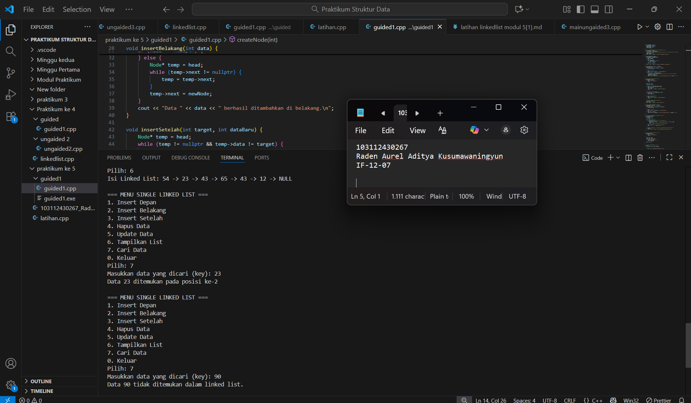

<h1 align="center">Laporan Praktikum Modul 5 <br> ADT & SLL </h1>
<p align="center">Raden Aurel Aditya Kusumawaningyun - 103112430267</p>

## Dasar Teori Modul 5
Operasi Pencarian Searching pada Singly Linked List. Dalam konteks struktur data dinamis, Searching merupakan salah satu operasi primitif atau operasi dasar yang esensial pada Linked List. Konsep ini berfokus pada aktivitas menemukan sebuah node tertentu di dalam list. Berbeda dengan Array yang dapat mengakses data secara langsung menggunakan indeks, Linked List harus menggunakan metode pencarian linier. Proses pencarian ini berjalan dengan mengunjungi setiap node secara berurutan, dimulai dari node pertama, dan berhenti seketika node yang dicari ditemukan. Keberhasilan operasi searching ini menjadi fondasi penting yang mempermudah implementasi operasi lanjutan yang lebih kompleks, seperti Insert After, Delete After, atau Update data. Secara konseptual, operasi searching ini adalah bagian dari Abstract Data Type (ADT) dari Linked List, di mana ADT sendiri adalah landasan yang mendefinisikan suatu tipe struktur data beserta serangkaian operasi primitif yang dapat dilakukan terhadapnya

Dalam implementasi praktis C++, struktur data ini memanfaatkan pointer operator-operator. Ketika pencarian dilakukan, sebuah pointer sementara (temp) akan disiapkan untuk memulai dari head dan bergerak maju melalui tautan (temp = temp->next) hingga node terakhir (nullptr), sambil membandingkan nilai info pada node saat ini dengan nilai key yang dicari. Keberadaan semua fungsi dasar searching dan utility lainnya dalam Linked List biasanya diwujudkan melalui pemisahan kode menjadi dua modul: Spesifikasi (.h) yang berisi deklarasi tipe dan prototipe fungsi, dan Realisasi (.c atau .cpp) yang berisi kode program aktual dari primitif tersebut. Pemahaman yang kuat terhadap logika searching ini, yang merupakan salah satu dari berbagai operasi yang dibahas dalam literatur seperti "C++ Primer" atau modul struktur data universitas, sangat krusial untuk menguasai pengelolaan memori dan struktur data dinamis secara keseluruhan.
## Guided Modul 5

### soal 1

```go
#include <iostream>
using namespace std;

// Struktur Node
struct Node {
    int data;
    Node* next;
};
Node* head = nullptr;

// Fungsi untuk membuat node baru
Node* createNode(int data) {
    Node* newNode = new Node();
    newNode->data = data;
    newNode->next = nullptr;
    return newNode;
}

// ========== INSERT DEPAN FUNCTION (Penambahan) ==========
void insertDepan(int data) {
    Node* newNode = createNode(data);
    // Logika Insert First: Node baru menunjuk ke head lama, lalu head menunjuk ke Node baru.
    newNode->next = head;
    head = newNode;
    cout << "Data " << data << " berhasil ditambahkan di depan.\n";
}

void insertBelakang(int data) {
    Node* newNode = createNode(data);
    if (head == nullptr) {
        head = newNode;
    } else {
        Node* temp = head;
        while (temp->next != nullptr) {
            temp = temp->next;
        }
        temp->next = newNode;
    }
    cout << "Data " << data << " berhasil ditambahkan di belakang.\n";
}

void insertSetelah(int target, int dataBaru) {
    Node* temp = head;
    while (temp != nullptr && temp->data != target) {
        temp = temp->next;
    }

    if (temp == nullptr) {
        cout << "Data " << target << " tidak ditemukan!\n";
    } else {
        Node* newNode = createNode(dataBaru);
        // Logika Insert After: Sambungkan newNode ke temp->next, lalu temp ke newNode
        newNode->next = temp->next;
        temp->next = newNode;
        cout << "Data " << dataBaru << " berhasil disisipkan setelah " << target << ".\n";
    }
}

// ========== DELETE FUNCTION ==========
void hapusNode(int data) {
    if (head == nullptr) {
        cout << "List kosong!\n";
        return;
    }

    Node* temp = head;
    Node* prev = nullptr;

    // Jika data di node pertama (Delete First)
    if (temp != nullptr && temp->data == data) {
        head = temp->next;
        delete temp;
        cout << "Data " << data << " berhasil dihapus.\n";
        return;
    }

    // Cari node yang akan dihapus
    while (temp != nullptr && temp->data != data) {
        prev = temp;
        temp = temp->next;
    }

    // Jika data tidak ditemukan
    if (temp == nullptr) {
        cout << "Data " << data << " tidak ditemukan!\n";
        return;
    }

    // Putuskan tautan: prev melompati temp
    prev->next = temp->next;
    delete temp;
    cout << "Data " << data << " berhasil dihapus.\n";
}

// ========== UPDATE FUNCTION ==========
void updateNode(int dataLama, int dataBaru) {
    Node* temp = head;
    while (temp != nullptr && temp->data != dataLama) {
        temp = temp->next;
    }

    if (temp == nullptr) {
        cout << "Data " << dataLama << " tidak ditemukan!\n";
    } else {
        temp->data = dataBaru;
        cout << "Data " << dataLama << " berhasil diupdate menjadi " << dataBaru << ".\n";
    }
}

// ========== SEARCH FUNCTION  ==========
void searchData(int key) {
    Node *temp = head;
    int pos = 1;
    bool found = false;

    while (temp != nullptr) {
        // Cek apakah data di node saat ini sama dengan key
        if (temp->data == key) {
            cout << "Data " << key << " ditemukan pada posisi ke-" << pos << endl;
            found = true;
            break; // Hentikan perulangan jika sudah ditemukan
        }
        temp = temp->next; // Geser ke node berikutnya
        pos++;             // Tambah posisi
    }

    // PENTING: Menggunakan 'if (!found)' untuk mengoreksi kesalahan logika asli
    if (!found) { 
        cout << "Data " << key << " tidak ditemukan dalam linked list.\n";
    }
}


// ========== DISPLAY FUNCTION ==========
void tampilkanList() {
    if (head == nullptr) {
        cout << "List kosong!\n";
        return;
    }

    Node* temp = head;
    cout << "Isi Linked List: ";
    while (temp != nullptr) {
        cout << temp->data << " -> ";
        temp = temp->next;
    }
    cout << "NULL\n";
}


// ========== MAIN PROGRAM ==========
int main() {
    int pilihan, data, target, dataBaru;

    do {
        cout << "\n=== MENU SINGLE LINKED LIST ===\n";
        cout << "1. Insert Depan\n";
        cout << "2. Insert Belakang\n";
        cout << "3. Insert Setelah\n";
        cout << "4. Hapus Data\n";
        cout << "5. Update Data\n";
        cout << "6. Tampilkan List\n";
        cout << "7. Cari Data\n"; 
        cout << "0. Keluar\n";
        cout << "Pilih: ";
        if (!(cin >> pilihan)) {
            // Menangani input non-integer
            cin.clear(); 
            cin.ignore(10000, '\n');
            pilihan = -1; // Set pilihan ke nilai default
        }

        switch (pilihan) {
            case 1:
                cout << "Masukkan data: ";
                cin >> data;
                insertDepan(data); 
                break;
            case 2:
                cout << "Masukkan data: ";
                cin >> data;
                insertBelakang(data);
                break;
            case 3:
                cout << "Masukkan data target: ";
                cin >> target;
                cout << "Masukkan data baru: ";
                cin >> dataBaru;
                insertSetelah(target, dataBaru);
                break;
            case 4:
                cout << "Masukkan data yang ingin dihapus: ";
                cin >> data;
                hapusNode(data);
                break;
            case 5:
                cout << "Masukkan data lama: ";
                cin >> data;
                cout << "Masukkan data baru: ";
                cin >> dataBaru;
                updateNode(data, dataBaru);
                break;
            case 6:
                tampilkanList();
                break;
            case 7: // Case baru untuk Search
                cout << "Masukkan data yang dicari (key): ";
                cin >> data;
                searchData(data);
                break;
            case 0:
                cout << "Program selesai.\n";
                break;
            default:
                cout << "Pilihan tidak valid!\n";
        }
    } while (pilihan != 0);

    return 0;
}

```


> Output
> 
> Berikut SS VS Code dari Program Soal No 1

penjelasan: 

Langkah-Langkah Proses Pencarian
1. Inisialisasi dan Looping: Pencarian dimulai dengan mengarahkan pointer temp ke head dan memulai perulangan while (temp != nullptr). Perulangan ini memastikan bahwa proses pencarian terus berjalan selama list belum mencapai akhir (nullptr).

2. Pengecekan dan Modifikasi Flag:
Di setiap node, program mengecek kondisi if (temp->data == key). Jika kondisi ini benar maka data ditemukan, program mencetak posisi (pos), mengubah flag found menjadi true, dan segera menghentikan perulangan dengan perintah break.

3. Pergeseran dan Penghitungan: Jika data tidak ditemukan, pointer temp digeser ke node berikutnya melalui temp = temp->next;, dan counter pos ditingkatkan (pos++).

4. Output Hasil Akhir: Setelah perulangan selesai, program mengecek flag if (!found) (yaitu, jika found masih false). Pengecekan ini menjamin bahwa pesan "data tidak ditemukan" hanya ditampilkan setelah seluruh Linked List dilalui tanpa menemukan nilai yang dicari.

Kesimpulan: Fungsi ini mendemonstrasikan metode pencarian linier pada Linked List. Dengan menggunakan flag found dan pointer temp, program dapat secara efisien mencari data dan membedakan antara keberhasilan (menggunakan break) dan kegagalan pencarian.
