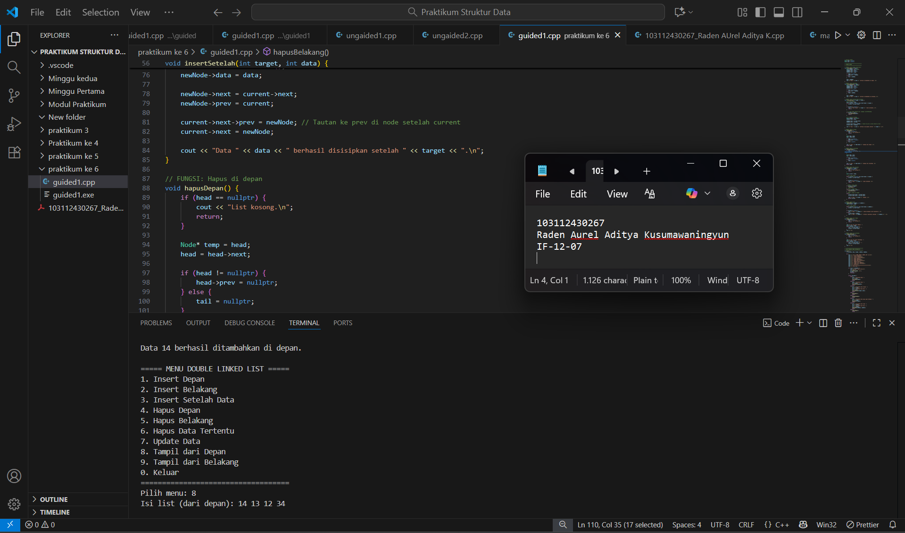

<h1 align="center">Laporan Praktikum Modul 6 <br> Double Linked List </h1>
<p align="center">Raden Aurel Aditya Kusumawaningyun - 103112430267</p>

## Dasar Teori Modul 6 
A. Konsep Dasar Linked List
1. Definisi dan Struktur Node

Linked list adalah salah satu bentuk struktur data dinamis yang berisi kumpulan data yang tersusun secara sekuensial, saling bersambungan, dan tidak terbatas. Linked list terdiri dari sejumlah node atau simpul yang dihubungkan secara linier dengan bantuan pointer. Struktur dasar dari linked list memungkinkan penggunaan memori yang efisien karena alokasi memori dilakukan secara dinamis sesuai kebutuhan.

2. Doubly Linked List

Doubly Linked List adalah jenis linked list di mana masing-masing elemennya memiliki dua successor atau pointer. Kedua pointer tersebut adalah: next yang menunjuk pada elemen sesudahnya dan prev yang menunjuk pada elemen sebelumnya. Struktur Doubly Linked List juga menggunakan dua pointer utama pada list, yaitu first menunjuk elemen pertama dan last menunjuk elemen terakhir.

3. Keunggulan Doubly Linked List
   
Keuntungan utama Doubly Linked List dibandingkan Singly Linked List adalah kemudahan akses elemen. Programmer dapat melakukan iterasi maju dan mundur, yang memudahkan proses pencarian searching, pembaruan update, dan penelusuran data dari kedua arah.

## Guided Modul 6

### soal 1

```go
#include <iostream>
using namespace std;

// ==================
// Struktur Node
// ==================
struct Node {
    int data;
    Node* prev;
    Node* next;
};

// Pointer global
Node* head = nullptr;
Node* tail = nullptr;

// =================================
// FUNGSI UTAMA (Diperbaiki dan Ditambahkan)
// =================================

// FUNGSI: Insert Depan (Dikoreksi)
void insertDepan(int data) {
    Node* newNode = new Node();
    newNode->data = data;
    newNode->prev = nullptr;
    newNode->next = head;

    if (head != nullptr) {
        head->prev = newNode;
    } else {
        tail = newNode; 
    }

    head = newNode;
    cout << "Data " << data << " berhasil ditambahkan di depan. \n";
}

// FUNGSI: Insert Belakang (Dikoreksi)
void insertBelakang(int data) {
    Node* newNode = new Node();
    newNode->data = data;
    newNode->next = nullptr;
    newNode->prev = tail;

    if (tail != nullptr) {
        tail->next = newNode;
    } else {
        head = newNode;
    }

    tail = newNode;
    cout << "Data " << data << " berhasil ditambahkan di belakang. \n";
}

// FUNGSI: Insert Setelah Data tertentu (Ditambahkan)
void insertSetelah(int target, int data) {
    // 1. Cari target
    Node* current = head; 
    while (current != nullptr && current->data != target) {
        current = current->next;
    }

    if (current == nullptr) {
        cout << "Data target " << target << " tidak ditemukan. \n";
        return;
    }
    
    // 2. Jika target adalah tail, panggil insertBelakang
    if (current == tail) {
        insertBelakang(data);
        return;
    }
    
    // 3. Insert di Tengah
    Node* newNode = new Node();
    newNode->data = data;
    
    newNode->next = current->next;
    newNode->prev = current;
    
    current->next->prev = newNode; // Tautan ke prev di node setelah current
    current->next = newNode;
    
    cout << "Data " << data << " berhasil disisipkan setelah " << target << ".\n";
}

// FUNGSI: Hapus di depan (DelFirst - Dikoreksi)
void hapusDepan() {
    if (head == nullptr) {
        cout << "List kosong.\n";
        return;
    }

    Node* temp = head;
    head = head->next;

    if (head != nullptr) {
        head->prev = nullptr;
    } else {
        tail = nullptr;
    }

    cout << "Data " << temp->data << " dihapus dari depan. \n";
    delete temp;
}

// FUNGSI: Hapus di belakang (DelLast - Dikoreksi)
void hapusBelakang() {
    if (tail == nullptr) {
        cout << "List kosong. \n";
        return;
    }

    Node* temp = tail;
    tail = tail->prev;

    if (tail != nullptr) {
        tail->next = nullptr;
    } else {
        head = nullptr;
    }

    cout << "Data " << temp->data << " dihapus dari belakang. \n";
    delete temp;
}

// FUNGSI: Hapus Data Tertentu (Ditambahkan)
void hapusData(int target) {
    if (head == nullptr) {
        cout << "List kosong.\n";
        return;
    }

    Node* current = head; 
    
    // Cari node target
    while (current != nullptr && current->data != target) {
        current = current->next;
    }

    if (current == nullptr) {
        cout << "Data " << target << " tidak ditemukan. \n";
        return;
    }

    // KASUS 1: Hapus Head
    if (current == head) {
        hapusDepan();
    } 
    // KASUS 2: Hapus Tail
    else if (current == tail) {
        hapusBelakang();
    } 
    // KASUS 3: Hapus di Tengah
    else {
        current->prev->next = current->next;
        current->next->prev = current->prev;
        
        cout << "Data " << target << " dihapus. \n";
        delete current;
    }
}

// FUNGSI: Update Data (Ditambahkan)
void updateData(int oldData, int newData) {
    Node* current = head;
    
    // Cari node oldData
    while (current != nullptr && current->data != oldData) {
        current = current->next;
    }

    if (current == nullptr) {
        cout << "Data " << oldData << " tidak ditemukan untuk diperbarui. \n";
    } else {
        current->data = newData;
        cout << "Data " << oldData << " berhasil diperbarui menjadi " << newData << ". \n";
    }
}

// FUNGSI: Tampil dari Depan (Sudah ada di input)
void tampilDepan() {
    if (head == nullptr) {
        cout << "List kosong.\n";
        return;
    }

    cout << "Isi list (dari depan): ";
    Node* current = head;
    while (current != nullptr) {
        cout << current->data << " ";
        current = current->next;
    }
    cout << "\n";
}

// FUNGSI: Tampil dari Belakang (Sudah ada di input)
void tampilBelakang() {
    if (tail == nullptr) {
        cout << "List kosong.\n";
        return;
    }

    cout << "Isi list (dari belakang): ";
    Node* current = tail;
    while (current != nullptr) {
        cout << current->prev << " ";
        current = current->prev;
    }
    cout << "\n";
}

// ====================================
// MAIN PROGRAM (MENU INTERAKTIF)
// ====================================
int main() {
    int pilihan, data, target, oldData, newData;

    do {
        cout << "\n===== MENU DOUBLE LINKED LIST =====\n";
        cout << "1. Insert Depan\n";
        cout << "2. Insert Belakang\n";
        cout << "3. Insert Setelah Data\n";
        cout << "4. Hapus Depan\n";
        cout << "5. Hapus Belakang\n";
        cout << "6. Hapus Data Tertentu\n";
        cout << "7. Update Data\n";
        cout << "8. Tampil dari Depan\n";
        cout << "9. Tampil dari Belakang\n";
        cout << "0. Keluar\n";
        cout << "===================================\n";
        cout << "Pilih menu: ";
        
        if (!(cin >> pilihan)) {
            cout << "Input tidak valid.\n";
            cin.clear();
            cin.ignore(10000, '\n');
            pilihan = -1;
            continue;
        }

        switch (pilihan) {
            case 1:
                cout << "Masukkan data: ";
                cin >> data;
                insertDepan(data);
                break;
            case 2:
                cout << "Masukkan data: ";
                cin >> data;
                insertBelakang(data);
                break;
            case 3:
                cout << "Masukkan data target: ";
                cin >> target;
                cout << "Masukkan data baru: ";
                cin >> data;
                insertSetelah(target, data);
                break;
            case 4:
                hapusDepan();
                break;
            case 5:
                hapusBelakang();
                break;
            case 6:
                cout << "Masukkan data yang ingin dihapus: ";
                cin >> target;
                hapusData(target);
                break;
            case 7:
                cout << "Masukkan data lama: ";
                cin >> oldData;
                cout << "Masukkan data baru: ";
                cin >> newData;
                updateData(oldData, newData);
                break;
            case 8:
                tampilDepan();
                break;
            case 9:
                tampilBelakang();
                break;
            case 0:
                cout << " Keluar dari program.\n";
                break;
            default:
                cout << "Pilihan tidak valid.\n";
        }

    } while (pilihan != 0);

    return 0;
}

```


> Output
> 
> Berikut SS VS Code dari Program Soal No 1

penjelasan: 

Fungsi program C++ ini adalah untuk mengimplementasikan dan mengelola struktur data Double Linked List secara dinamis melalui menu interaktif. Program mendefinisikan struktur Node dengan pointer prev dan next untuk tautan dua arah, serta menggunakan pointer global head dan tail untuk menandai ujung list. Program menyediakan fungsionalitas lengkap untuk manipulasi list, termasuk penyisipan yaitu insertDepan, insertBelakang, insertSetelah, lalu penghapusan yaitu hapusDepan, hapusBelakang, hapusData, pembaruan yaitu updateData, dan penampilan data dari kedua arah yaitu tampilDepan, tampilBelakang. Fungsi main menjalankan menu interaktif yang menggunakan switch-case dan perulangan do-while, memungkinkan pengguna untuk menguji semua operasi list secara berulang hingga memilih opsi 0 maka akan Keluar.


## Ungaided Modul 6

### soal 1


```go
#include <iostream>
#include <string>
#include <cstdlib>

using namespace std;

struct kendaraan {
    std::string nopol;
    std::string warna;
    int thnBuat;
};

typedef kendaraan infotype;
typedef struct elmlist* address;

struct elmlist {
    infotype info;
    address next;
    address prev;
};

struct List {
    address First;
    address Last;
};

void CreateList(List& L) {
    L.First = nullptr;
    L.Last = nullptr;
}

address alokasi(infotype X) {
    address P = new elmlist;
    P->info = X;
    P->next = nullptr;
    P->prev = nullptr;
    return P;
}

void dealokasi(address& P) {
    delete P;
    P = nullptr;
}

address findElm(const List& L, const std::string& nopolTarget) {
    address P = L.First;
    while (P != nullptr) {
        if (P->info.nopol == nopolTarget) {
            return P;
        }
        P = P->next;
    }
    return nullptr; 
}

void insertFirst(List& L, address P) {
    if (L.First == nullptr) { 
        L.First = P;
        L.Last = P;
    } else { 
        P->next = L.First; 
        L.First->prev = P; 
        L.First = P;
    }
}

void printInfo(const List& L) {
    if (L.First == nullptr) {
        cout << "LIST KOSONG." << endl;
        return;
    }
    
    address P = L.Last; 
    
    cout << "\nDATA LIST 1" << endl;
    
    P = L.First;
    while (P != nullptr) {
        cout << "no polisi : " << P->info.nopol << endl;
        cout << "warna     : " << P->info.warna << endl;
        cout << "tahun     : " << P->info.thnBuat << endl;
        P = P->next;
    }
}

void inputKendaraan(List& L) {
    infotype data;
    
    cout << "masukkan nomor polisi: ";
    cin >> data.nopol;
    
    if (findElm(L, data.nopol) != nullptr) {
        cout << "nomor polisi sudah terdaftar" << endl;
        cin.ignore(10000, '\n'); 
        return;
    }
    
    cout << "masukkan warna kendaraan: ";
    cin >> data.warna;
    
    cout << "masukkan tahun kendaraan: ";
    while (!(cin >> data.thnBuat)) {
        cout << "Input tahun tidak valid. Masukkan angka: ";
        cin.clear();
        cin.ignore(10000, '\n');
    }

    address P = alokasi(data);
    insertFirst(L, P); 

    cout << "Data berhasil disisipkan di depan." << endl;

    cin.ignore(10000, '\n'); 
}

int main() {
    List L;
    CreateList(L);
    int pilihan;

    do {
        cout << "\n===== MENU DLL KENDARAAN =====" << endl;
        cout << "1. Masukkan Data Kendaraan" << endl;
        cout << "2. Tampilkan Semua Data" << endl;
        cout << "0. Keluar" << endl;
        cout << "Pilih menu: ";
        
        if (!(cin >> pilihan)) {
            cout << "Input tidak valid.\n";
            cin.clear();
            cin.ignore(10000, '\n');
            pilihan = -1;
            continue;
        }
        
        switch (pilihan) {
            case 1:
                inputKendaraan(L);
                break;
            case 2:
                printInfo(L);
                break;
            case 0:
                cout << "Keluar dari program." << endl;
                break;
            default:
                cout << "Pilihan tidak valid." << endl;
        }

    } while (pilihan != 0);
    
    address current = L.First;
    while (current != nullptr) {
        address next = current->next;
        dealokasi(current);
        current = next;
    }
    L.First = L.Last = nullptr;
    
    return 0;
}

```


> Output
> 
> Berikut SS VS Code dari Program Soal No 1

penjelasan: 


## Daftar Pustaka
Munir, R. (2016). Algoritma dan Pemrograman dalam Bahasa Pascal, C, dan C++ Edisi Keenam. Bandung: Informatika. Konsep Linked List)

Sari, A. P., Yuflianda, I. A., & Simangunsong, R. M. (2021). Implementasi Doubly Linked List pada Aplikasi Pengolahan Data Penjualan Tiket Bioskop Berbasis C++. Jurnal Komputer dan Aplikasi, 9(1), 164-171. Diakses dari https://jurnal.polmed.ac.id/index.php/komputasi/article/view/2108. 

Guna, L. A. (2022). Implementasi Prosedur dan Fungsi Dalam Bahasa Pemrograman Python. Jurnal Portal Data, 2(1). Diakses melalui https://ejurnal-bpptik.kominfo.go.id/index.php/jpd/article/view/118.
