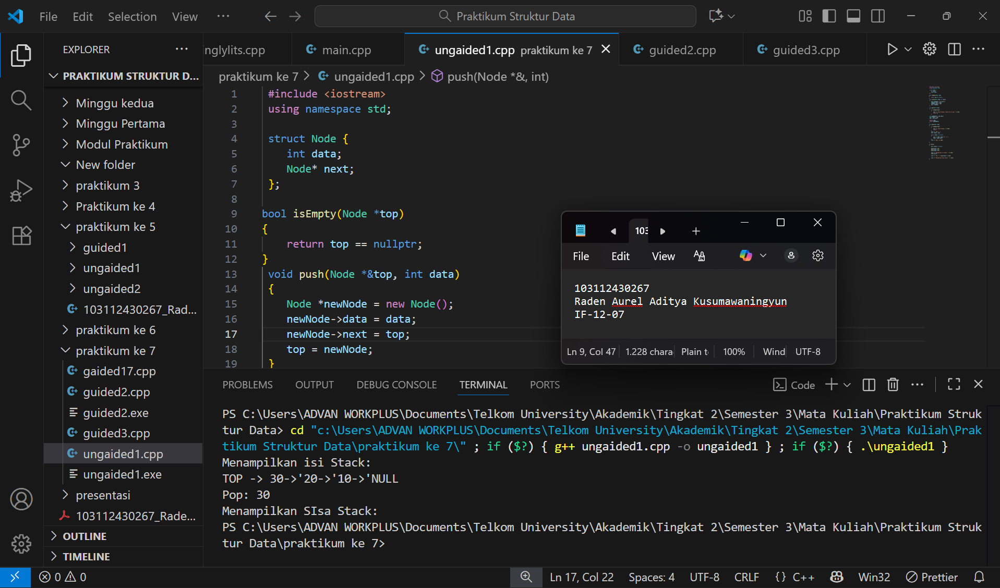
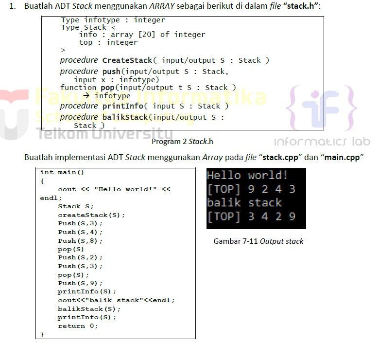
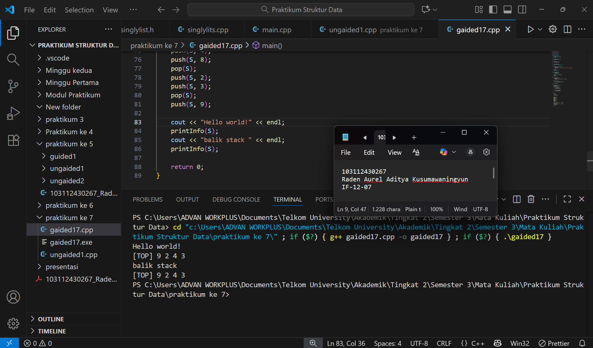
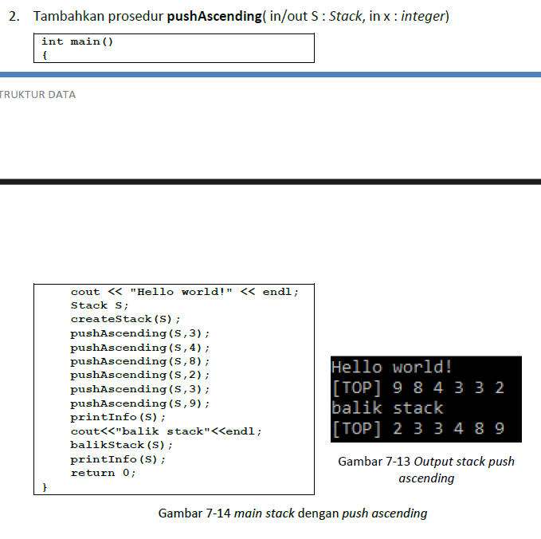
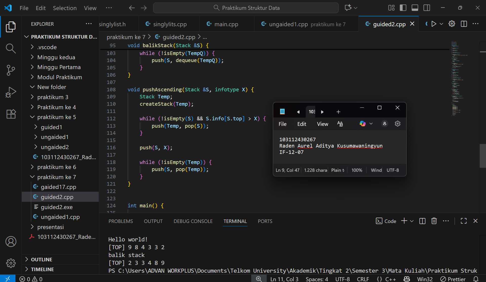
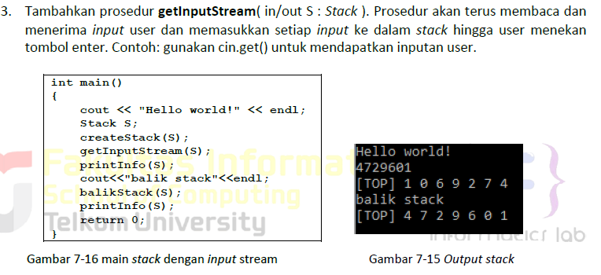
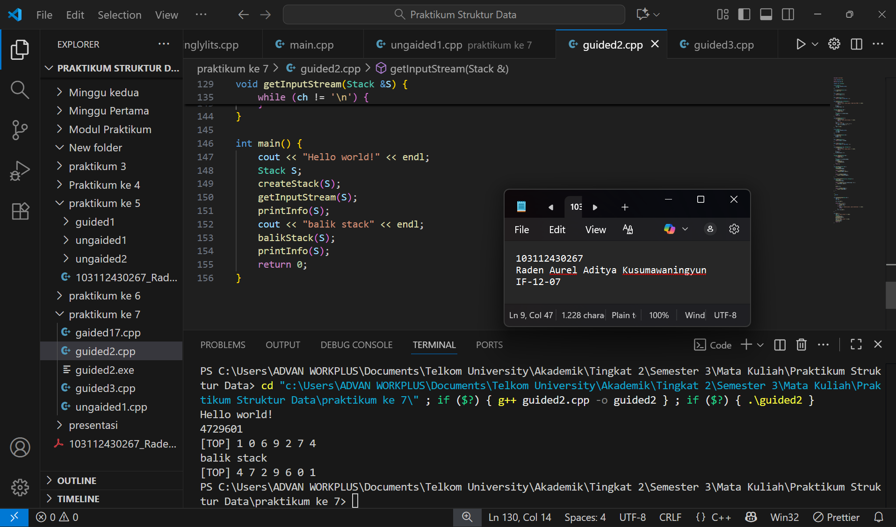

<h1 align="center">Laporan Praktikum Modul 7 <br> STACK </h1>
<p align="center">Raden Aurel Aditya Kusumawaningyun - 103112430267</p>

## Dasar Teori Modul 7
A. Konsep Dasar STACK

1. Konsep Dasar Stack
Stack merupakan salah satu bentuk struktur data yang beroperasi berdasarkan prinsip tumpukan, di mana prinsip operasi yang digunakan adalah Last In First Out (LIFO). Ini berarti bahwa elemen yang terakhir kali masuk ke dalam tumpukan adalah elemen yang pertama kali dapat diambil. Dalam representasi Linked List, Stack terdiri dari elemen-elemen yang saling terkait, namun akses data hanya dapat dilakukan pada elemen paling awal saja, yang disebut "Top". Struktur Stack dapat diimplementasikan menggunakan representasi pointer atau representasi tabel.

2. Operasi Primitif Stack
Terdapat dua operasi utama dalam Stack: Push atau penyisipan dan Pop atau pengambilan.
- Push Operasi menyisipkan elemen baru pada tumpukan data. Dalam implementasi Stack menggunakan pointer, operasi ini identik dengan operasi insert first pada Linked List biasa. Dalam representasi tabel, Push dilakukan dengan menggeser indeks TOP ke indeks berikutnya (TOP = TOP + 1) dan memasukkan data pada indeks TOP yang baru.
- Pop Operasi pengambilan data yang selalu dilakukan pada elemen paling atas (Top). Dalam implementasi pointer, Pop mirip dengan operasi delete first. Setelah data diambil, indeks TOP akan bergeser ke indeks sebelumnya (TOP = TOP - 1), tanpa harus menghilangkan informasi dari indeks TOP sebelumnya.

4. Implementasi dan Aplikasi
Implementasi Stack harus dilengkapi dengan beberapa fungsi primitif untuk memastikan manajemen Stack berjalan dengan benar, termasuk createStack() untuk inisialisasi, isEmpty() untuk pengecekan status, dan fungsi pencarian. Perbedaan utama antara representasi pointer dan tabel terletak pada manajemen memori; representasi pointer memerlukan alokasi dan dealokasi memori, sedangkan representasi tabel tidak memerlukannya karena menggunakan array berindeks yang ukurannya sudah terbatas. Struktur data Stack sering diaplikasikan dalam komputasi, salah satunya untuk pemrosesan ekspresi matematika (infix ke postfix atau prefix) dan manajemen memori panggilan fungsi (call stack).


## Guided Modul 7

### soal 1

```go
 #include <iostream>
 using namespace std;

 struct Node {
    int data;
    Node* next;
 };

bool isEmpty(Node *top)
{
    return top == nullptr;
}
 void push(Node *&top, int data)
 {
    Node *newNode = new Node(); 
    newNode->data = data;
    newNode->next = top;
    top = newNode;
 }

 int pop(Node *&top)
 {
    if (isEmpty(top))
    {
        cout << "Stack kosong, tidak bisa di pop!" << endl;
        return 0;
    }
 
 int poppedData = top->data;
 Node *temp = top;
 top = top->next;

 delete temp;
 return poppedData;
}

void show(Node *top) 
{
    if (isEmpty(top))
    {
        cout << "stack kosong." << endl;
        return;
    }
    cout << "TOP -> ";
    Node *temp = top;

    while (temp != nullptr)
    {
        cout << temp ->data << "->'";
        temp = temp->next;
    }
    cout << "NULL" << endl;
    
}

int main()
{
    Node *stack = nullptr;

    push(stack, 10);
    push(stack, 20);
    push(stack, 30);

    cout << "Menampilkan isi Stack: " << endl;
    show(stack);

    cout << "Pop: " << pop(stack) << endl;

    cout << "Menampilkan SIsa Stack: " << endl;
}

```


> Output
> 
> Berikut SS VS Code dari Program Soal No 1

penjelasan: 

Program C++ ini berfungsi untuk mengimplementasikan struktur data Stack menggunakan representasi Linked List dan menguji operasi dasar Last In First Out (LIFO). Program mendefinisikan struktur Node dengan pointer next dan menggunakan pointer top untuk menandai elemen teratas tumpukan. Logika utamanya terletak pada dua operasi primitif: push, yang menyisipkan elemen baru selalu di posisi top, dan pop, yang mengambil dan menghapus elemen dari posisi top. Fungsi show digunakan untuk menampilkan seluruh isi Stack dimulai dari TOP, sementara fungsi isEmpty memastikan operasi tidak dilakukan pada Stack kosong. Fungsi main menguji operasi ini secara berurutan: menyisipkan elemen 30, 20, 10, menampilkan Stack, dan menghapus satu elemen teratas.


## Unguided Modul 7

### soal 1

> 

```go
 #include <iostream>

using namespace std;

#define MAX_SIZE 20

typedef int infotype;
struct Stack {
    infotype info[MAX_SIZE];
    int top;
};

void createStack(Stack &S) {
    S.top = -1; 
}

bool isEmpty(Stack S) {
    return S.top == -1;
}

bool isFull(Stack S) {
    return S.top == (MAX_SIZE - 1);
}

void push(Stack &S, infotype X) {
    if (isFull(S)) {
        cout << "Error: Stack penuh, tidak bisa PUSH." << endl;
        return;
    }
    S.top++;
    S.info[S.top] = X;
}

infotype pop(Stack &S) {
    if (isEmpty(S)) {
        return 0; 
    }
    infotype X = S.info[S.top];
    S.top--;
    return X; 
}

void printInfo(Stack S) {
    if (isEmpty(S)) {
        cout << "[TOP] Stack kosong." << endl;
        return;
    }
    cout << "[TOP] ";
    for (int i = S.top; i >= 0; i--) {
        cout << S.info[i] << " ";
    }
    cout << endl;
}

void balikStack(Stack &S) {
    Stack Temp;
    createStack(Temp);
    
    while (!isEmpty(S)) {
        push(Temp, pop(S));
    }
    
    while (!isEmpty(Temp)) {
        push(S, pop(Temp));
    }
}

int main() {
    
    Stack S;
    createStack(S);

   
    push(S, 3);
    push(S, 4);
    push(S, 8);
    pop(S); 
    push(S, 2);
    push(S, 3);
    pop(S); 
    push(S, 9);

    cout << "Hello world!" << endl;
    printInfo(S);
    cout << "balik stack " << endl;
    printInfo(S); 

    return 0;
}
```


> Output
> 
> Berikut SS VS Code dari Program Soal No 1

penjelasan: 

Program C++ ini berfungsi untuk mengimplementasikan struktur data Stack menggunakan representasi Array dengan prinsip Last In First Out (LIFO). Struktur Stack didefinisikan dengan array info dan integer top sebagai penunjuk elemen teratas. Logika utama program ini mencakup prosedur push untuk menyisipkan data baru dengan menaikkan top, fungsi pop untuk mengambil dan menghapus elemen teratas dengan menurunkan top, dan prosedur balikStack yang membalik urutan elemen dalam Stack dengan bantuan Stack sementara. Fungsi main menginisialisasi Stack, menjalankan serangkaian operasi push dan pop sesuai skenario, dan kemudian memanggil printInfo untuk menampilkan sisa elemen dari Stack tersebut, dimulai dari posisi TOP.

### soal 2

> 

```go
 #include <iostream>

using namespace std;

#define MAX_SIZE 20

typedef int infotype;
struct Stack {
    infotype info[MAX_SIZE];
    int top;
};

void createStack(Stack &S) {
    S.top = -1;
}

bool isEmpty(Stack S) {
    return S.top == -1;
}

bool isFull(Stack S) {
    return S.top == (MAX_SIZE - 1);
}

void push(Stack &S, infotype X) {
    if (isFull(S)) {
        cout << "Error: Stack penuh, tidak bisa PUSH." << endl;
        return;
    }
    S.top++;
    S.info[S.top] = X;
}

infotype pop(Stack &S) {
    if (isEmpty(S)) {
        return 0;
    }
    infotype X = S.info[S.top];
    S.top--;
    return X;
}

void printInfo(Stack S) {
    if (isEmpty(S)) {
        cout << "[TOP] Stack kosong." << endl;
        return;
    }
    cout << "[TOP] ";
    for (int i = S.top; i >= 0; i--) {
        cout << S.info[i] << " ";
    }
    cout << endl;
}

struct Queue {
    infotype info[MAX_SIZE];
    int head; 
    int tail; 
};

void createQueue(Queue &Q) {
    Q.head = 0; 
    Q.tail = -1; 
}

bool isEmpty(Queue Q) {
    return Q.tail < Q.head;
}

bool isFull(Queue Q) {
    return Q.tail == (MAX_SIZE - 1);
}

void enqueue(Queue &Q, infotype X) {
    if (isFull(Q)) {
        cout << "Error: Queue penuh." << endl;
        return;
    }
    Q.tail++;
    Q.info[Q.tail] = X;
}

infotype dequeue(Queue &Q) {
    if (isEmpty(Q)) {
        return 0;
    }
    infotype X = Q.info[Q.head];
    Q.head++;
    if (isEmpty(Q)) {
        createQueue(Q);
    }
    return X;
}

void balikStack(Stack &S) {
    Queue TempQ;
    createQueue(TempQ);

    while (!isEmpty(S)) {
        enqueue(TempQ, pop(S));
    }

    while (!isEmpty(TempQ)) {
        push(S, dequeue(TempQ));
    }
}

void pushAscending(Stack &S, infotype X) {
    Stack Temp;
    createStack(Temp);

    while (!isEmpty(S) && S.info[S.top] > X) {
        push(Temp, pop(S));
    }

    push(S, X);

    while (!isEmpty(Temp)) {
        push(S, pop(Temp));
    }
}


int main() {  

    Stack S;
    createStack(S);

    pushAscending(S, 3);
    pushAscending(S, 4);
    pushAscending(S, 8);
    pushAscending(S, 2);
    pushAscending(S, 3);
    pushAscending(S, 9);

    cout << "Hello world!" << endl;

    printInfo(S); 

    cout << "balik stack" << endl;

    balikStack(S); 

    printInfo(S); 

    return 0;
}
```


> Output
> 
> Berikut SS VS Code dari Program Soal No 2

penjelasan: 

Kode C++ ini mendefinisikan implementasi dua struktur data dasar, Stack dan Queue, menggunakan array statis berukuran 20. Kode ini menyediakan fungsi-fungsi primitif untuk kedua struktur tersebut, seperti create, isEmpty, isFull, serta operasi inti yaitu push/pop untuk Stack LIFO dan enqueue/dequeue untuk Queue FIFO. Terdapat dua fungsi operasional utama yang memanfaatkan struktur ini. Pertama, fungsi pushAscending yang memasukkan elemen baru ke dalam stack utama sambil menjaga agar elemen-elemen di stack tetap terurut descending, dengan menggunakan stack temporer sebagai bantuan. Kedua, fungsi balikStack yang membalik urutan seluruh elemen di dalam stack; ini dicapai dengan cara memindahkan semua elemen dari Stack (LIFO) ke sebuah Queue temporer (FIFO), lalu mengembalikan elemen-elemen tersebut dari Queue ke Stack, sehingga urutannya menjadi terbalik. Program main mendemonstrasikan alur ini dengan mengisi stack menggunakan pushAscending menghasilkan "[TOP] 9 8 4 3 3 2", mencetaknya, memanggil balikStack, lalu mencetak hasilnya yang sudah terbalik "[TOP] 2 3 3 4 8 9".

### soal 3

> 

```go
 #include <iostream>

using namespace std;

#define MAX_SIZE 20

typedef char infotype;

struct Stack {
    infotype info[MAX_SIZE];
    int top;
};

void createStack(Stack &S) {
    S.top = -1;
}

bool isEmpty(Stack S) {
    return S.top == -1;
}

bool isFull(Stack S) {
    return S.top == (MAX_SIZE - 1);
}

void push(Stack &S, infotype X) {
    if (isFull(S)) {
        cout << "Error: Stack penuh, tidak bisa PUSH." << endl;
        return;
    }
    S.top++;
    S.info[S.top] = X;
}

infotype pop(Stack &S) {
    if (isEmpty(S)) {
        return '\0'; 
    }
    infotype X = S.info[S.top];
    S.top--;
    return X;
}

void printInfo(Stack S) {
    if (isEmpty(S)) {
        cout << "[TOP] Stack kosong." << endl;
        return;
    }
    cout << "[TOP] ";
    for (int i = S.top; i >= 0; i--) {
        cout << S.info[i] << " ";
    }
    cout << endl;
}

struct Queue {
    infotype info[MAX_SIZE];
    int head;
    int tail;
};

void createQueue(Queue &Q) {
    Q.head = 0;
    Q.tail = -1;
}

bool isEmpty(Queue Q) {
    return Q.tail < Q.head;
}

bool isFull(Queue Q) {
    return Q.tail == (MAX_SIZE - 1);
}

void enqueue(Queue &Q, infotype X) {
    if (isFull(Q)) {
        cout << "Error: Queue penuh." << endl;
        return;
    }
    Q.tail++;
    Q.info[Q.tail] = X;
}

infotype dequeue(Queue &Q) {
    if (isEmpty(Q)) {
        return '\0';
    }
    infotype X = Q.info[Q.head];
    Q.head++;
    if (isEmpty(Q)) {
        createQueue(Q);
    }
    return X;
}

void balikStack(Stack &S) {
    Queue TempQ;
    createQueue(TempQ);

    while (!isEmpty(S)) {
        enqueue(TempQ, pop(S));
    }

    while (!isEmpty(TempQ)) {
        push(S, dequeue(TempQ));
    }
}

void pushAscending(Stack &S, infotype X) {
    Stack Temp;
    createStack(Temp);

    while (!isEmpty(S) && S.info[S.top] > X) {
        push(Temp, pop(S));
    }

    push(S, X);

    while (!isEmpty(Temp)) {
        push(S, pop(Temp));
    }
}


/**
 * @brief 
 */

void getInputStream(Stack &S) {
    cout << "";
    char ch;
    
    ch = cin.get();

    while (ch != '\n') {
        if (!isFull(S)) {
            push(S, ch);
        } else {
            cout << "\nStack penuh, input dihentikan." << endl;
            break; 
        }
        ch = cin.get();
    }
}

int main() {
    cout << "Hello world!" << endl;
    Stack S;
    createStack(S);
    getInputStream(S); 
    printInfo(S);
    cout << "balik stack" << endl;
    balikStack(S); 
    printInfo(S);
    return 0;
}
```


> Output
> 
> Berikut SS VS Code dari Program Soal No 3

penjelasan: 

Kode C++ ini mengimplementasikan dua struktur data fundamental, Stack dan Queue, yang keduanya menggunakan array statis berkapasitas 20 untuk menyimpan data bertipe char. Program ini berfokus pada dua operasi utama yaitu pertama, fungsi getInputStream yang bertugas membaca aliran karakter yang diketik pengguna hingga tombol Enter ditekan dan memasukkannya satu per satu ke dalam stack. Karena sifat stack adalah Last-In, First-Out (LIFO), urutan elemen di dalam stack akan menjadi kebalikan dari urutan input pengguna. Kedua, fungsi balikStack yang bertugas membalikkan kembali urutan elemen di dalam stack tersebut; ini dicapai dengan cara memindahkan semua elemen dari stack ke queue temporer, lalu mengembalikannya lagi ke stack. Alur program main secara berurutan mencetak "Hello world!", mengambil input stream dari pengguna, menampilkan isi stack yang terbalik, memanggil fungsi balikStack, dan terakhir menampilkan isi stack yang kini sudah kembali ke urutan aslinya.

# Notes : 
- untuk di ss nama file di foto terlampir tidak sesuai dengan yang di laporan, jadi fokusnya ke laporan saja karena sudah sesuai dengan Praktikum yang di kerjakan di kelas & di rumah

# Daftar Pustaka

Putra, D. P., Herlambang, A. D., & Rachmadi, A. (2023). Pengembangan Aplikasi Web IDE berbasis Mobile sebagai Alat Bantu Proses Pembelajaran Pemrograman Web Kelas X TKJ di SMK Cendika Bangsa. Jurnal Pengembangan Teknologi Informasi dan Ilmu Komputer, 7(7), 3260-3267.

Ma’arif, A. (2021). Dasar pemrograman bahasa C++. Universitas Ahmad Dahlan.

Indahyati, Uce., Rahmawati Yunianita. (2020). "BUKU AJAR ALGORITMA DAN PEMROGRAMAN DALAM BAHASA C++". Sidoarjo: Umsida Press. Diakses pada 10 Maret 2024 melalui https://doi.org/10.21070/2020/978-623-6833-67-4.

Guna, L. A. (2022). Implementasi Prosedur dan Fungsi Dalam Bahasa Pemrograman Python. Jurnal Portal Data, 2(1). Diakses melalui https://ejurnal-bpptik.kominfo.go.id/index.php/jpd/article/view/118.

[1.1] Suryadi, B., & Herlambang, T. S. (2018). Implementasi Str
