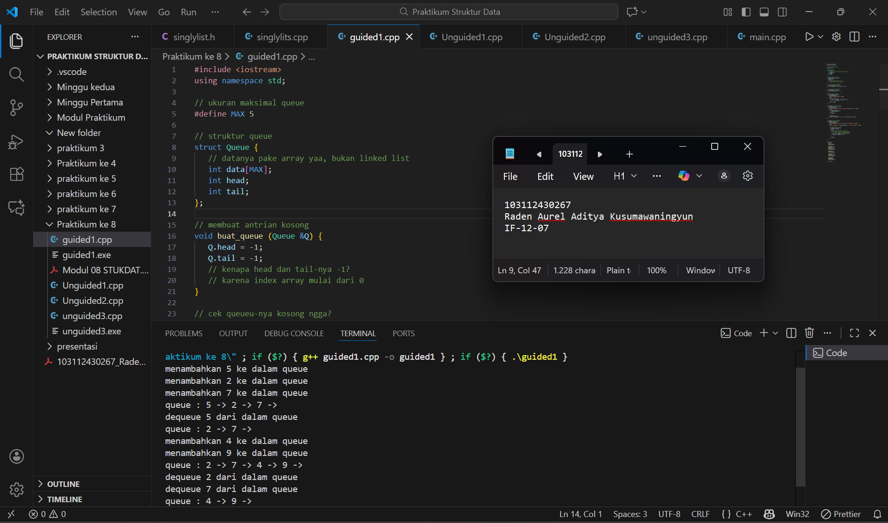
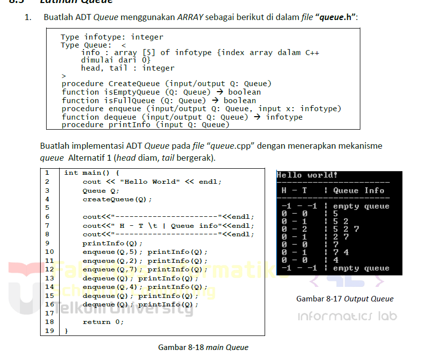
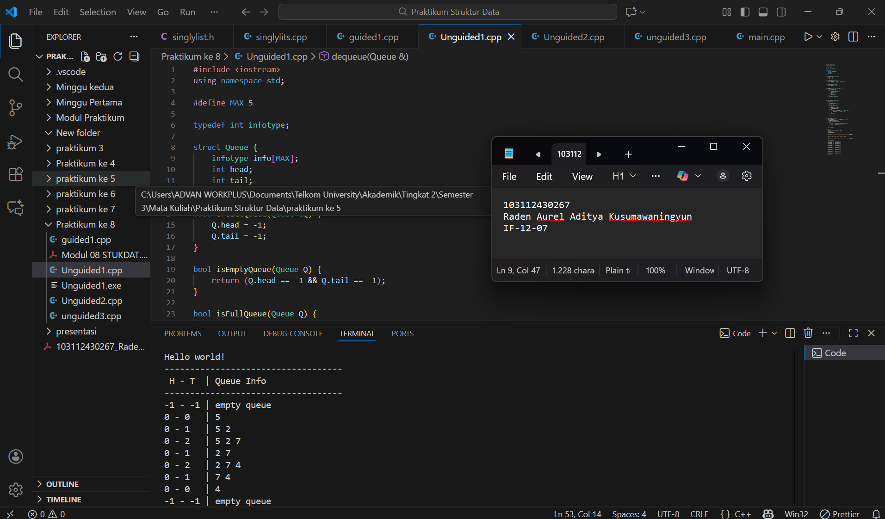
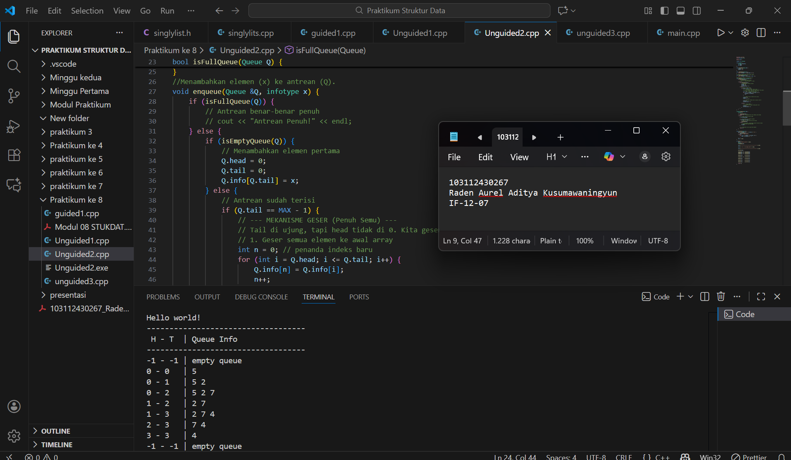
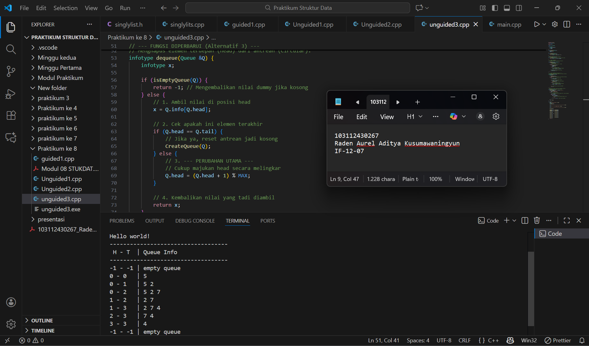

<h1 align="center">Laporan Praktikum Modul 8 <br> QUEUE </h1>
<p align="center">Raden Aurel Aditya Kusumawaningyun - 103112430267</p>

## Dasar Teori Modul 8
A. Konsep Dasar QUEUE

Queue atau antrean adalah sebuah struktur data linear yang dapat diumpamakan seperti antrean dalam kehidupan sehari-hari, misalnya antrean pada loket pembelian tiket. Dalam struktur data ini, elemen-elemen diatur dalam barisan berdasarkan prinsip First In, First Out. Prinsip ini menyatakan bahwa elemen yang pertama kali masuk ke dalam antrean akan menjadi elemen yang pertama kali diakses atau keluar dari antrean tersebut. Konsekuensinya, penambahan elemen hanya dapat dilakukan pada satu ujung yang disebut bagian belakang Tail, sementara penghapusan atau pengambilan elemen hanya dapat dilakukan pada ujung lainnya yang disebut bagian depan Head.

Terdapat dua operasi utama dalam Queue, yaitu Enqueue dan Dequeue. Enqueue adalah operasi untuk menambahkan elemen baru ke dalam Queue, yang sesuai dengan prinsip FIFO, selalu dilakukan pada bagian akhir antrean. Sebaliknya, Dequeue adalah operasi untuk mengambil atau menghapus elemen dari Queue, yang selalu dilakukan pada bagian awal antrean. Selain itu, terdapat pula operasi bantu seperti IsEmpty untuk memeriksa apakah Queue dalam keadaan kosong dan IsFull untuk memeriksa apakah Queue penuh, yang sangat relevan pada implementasi menggunakan array.

Struktur Queue dapat diimplementasikan dalam dua bentuk utama yaitu menggunakan linked list atau menggunakan array. Implementasi menggunakan linked list, seperti yang dibahas dalam modul praktikum, memiliki kelebihan dalam hal manajemen memori dan jumlah elemen yang dinamis atau tidak terbatas. Dalam representasi pointer ini, operasi insert hanya dilakukan pada Tail dan delete hanya pada Head.

Berbeda dengan linked list, implementasi menggunakan array bersifat statis, artinya jumlah Queue terbatas sesuai ukuran array yang didefinisikan. Terdapat beberapa alternatif implementasi array. Alternatif pertama adalah dengan Head tetap dan Tail bergerak, namun ini tidak efisien saat dequeue karena memerlukan pergeseran semua elemen. Alternatif kedua, di mana Head dan Tail sama-sama bergerak, lebih efisien namun dapat menimbulkan masalah "penuh semu". Implementasi array yang paling efisien adalah Circular Queue atau yang sering disebut sebagai "circular buffer". Pada strategi ini, Head dan Tail "berputar" mengelilingi indeks tabel. Jika Tail mencapai indeks maksimal, successor-nya adalah indeks pertama, sehingga tidak perlu lagi ada pergeseran elemen saat penambahan atau penghapusan.

Selain Simple Queue dan Circular Queue, terdapat variasi lain seperti Priority Queue, di mana elemen dilayani berdasarkan prioritasnya alih-alih urutan kedatangan, dan Double-Ended Queue, yang memungkinkan operasi enqueue dan dequeue dari kedua ujung. Queue merupakan komponen fundamental dalam berbagai aplikasi komputasi. Struktur data ini digunakan secara luas untuk penjadwalan proses dalam sistem operasi, manajemen buffer untuk streaming data atau router jaringan, dan pengelolaan antrean pencetakan. Selain itu, Queue menjadi dasar dari algoritma pencarian Breadth-First Search pada graph dan untuk memodelkan berbagai sistem antrean di dunia nyata.

## Guided Modul 8

### soal 1

```go
 #include <iostream>
using namespace std;

// ukuran maksimal queue
#define MAX 5

// struktur queue
struct Queue {
   // datanya pake array yaa, bukan linked list
   int data[MAX];
   int head;
   int tail;
};

// membuat antrian kosong
void buat_queue (Queue &Q) {
   Q.head = -1;
   Q.tail = -1;
   // kenapa head dan tail-nya -1?
   // karena index array mulai dari 0
}

// cek queueu-nya kosong ngga?
bool cek_kosong (Queue Q) {
   return (Q.head == -1 && Q.tail == -1);
}

// cek queue-nya penuh ngga?
bool cek_penuh (Queue Q) {
   return (Q.tail == MAX - 1);
}

// menampilkan isi queue
void print_queue (Queue Q) {
   if (cek_kosong(Q)) {
      cout << "queue kosong" << endl;
   } else {
      cout << "queue : ";
      for (int i = Q.head; i <= Q.tail; i++) {
         cout << Q.data[i] << " -> ";
      }
      cout << endl;
   }
}

// menambahkan elemen (enqueue)
void enqueue (Queue &Q, int x) {
   if (cek_penuh(Q)) {
      cout << "queue sudah penuh, tidak bisa menambah data" << endl;
   } else {
      if (cek_kosong(Q)) {
         Q.head = Q.tail = 0;
      } else {
         Q.tail++;
      }

      Q.data[Q.tail] = x;
      cout << "menambahkan " << x << " ke dalam queue" << endl;
   }
}

// menghapus elemen (dequeue)
void dequeue (Queue &Q) {
   if (cek_kosong(Q)) {
      cout << "queue kosong, tidak ada yang bisa dihapus" << endl;
   } else {
      cout << "dequeue " << Q.data[Q.head] << " dari dalam queue" << endl;

      // jika hanya ada 1 elemen
      if (Q.head == Q.tail) {
         Q.head = Q.tail = -1;
      } else {
         // geser semua elemen ke depan/kiri
         // biar tempat kosong di depan dipenuhin
         // dan tempat di belakang bisa dikosongin
         for (int i = Q.head; i < Q.tail; i++) {
            Q.data[i] = Q.data[i + 1];
         }

         Q.tail--;
      }
   }
}

// eksekutor
int main() {
   Queue Q;
   buat_queue(Q);

   enqueue(Q, 5);
   enqueue(Q, 2);
   enqueue(Q, 7);
   print_queue(Q);

   dequeue(Q);
   print_queue(Q);

   enqueue(Q, 4);
   enqueue(Q, 9);
   print_queue(Q);

   dequeue(Q);
   dequeue(Q);
   print_queue(Q);

   return 0;
}
```


> Output
> 
> Berikut SS VS Code dari Program Soal No 1

penjelasan: 

Kode C++ ini mengimplementasikan struktur data Queue menggunakan representasi tabel dengan ukuran tetap MAX = 5. Implementasi ini secara spesifik mengikuti metode di mana head secara konseptual tetap diam di awal. Sebuah antrean kosong ditandai dengan head dan tail bernilai -1. Operasi enqueue akan mengisi data pada indeks tail, dan menggeser tail ke kanan, jika antrean awalnya kosong, head dan tail diatur ke 0 terlebih dahulu. Bagian paling khas dari kode ini adalah operasi dequeue yaitu setelah elemen di head diambil, semua elemen sisa di belakangnya akan digeser satu per satu ke posisi depan mengisi indeks 0, 1, 2, dst., dan nilai tail akan dikurangi. Metode pergeseran ini memastikan elemen terdepan selalu dapat diakses di indeks 0, namun memiliki konsekuensi efisiensi karena harus memindahkan banyak elemen setiap kali terjadi dequeue. Fungsi main kemudian mendemonstrasikan alur kerja antrean ini dengan beberapa kali menambah, menghapus, dan mencetak isi antrean.

## Unguided Modul 8

### soal 1

> 

```go
 #include <iostream>
using namespace std;

#define MAX 5

typedef int infotype;

struct Queue {
    infotype info[MAX]; 
    int head;
    int tail;
};

void CreateQueue(Queue &Q) {
    Q.head = -1;
    Q.tail = -1;
}

bool isEmptyQueue(Queue Q) {
    return (Q.head == -1 && Q.tail == -1);
}

bool isFullQueue(Queue Q) {
    return (Q.tail == MAX - 1);
}

void enqueue(Queue &Q, infotype x) {
    if (isFullQueue(Q)) {
    } else {
        if (isEmptyQueue(Q)) {
            Q.head = 0;
            Q.tail = 0;
        } else {
            Q.tail++;
        }
        Q.info[Q.tail] = x;
    }
}

infotype dequeue(Queue &Q) {
    infotype x; 

    if (isEmptyQueue(Q)) {
        return -1; 
    } else {
        x = Q.info[Q.head];

        if (Q.head == Q.tail) {
            CreateQueue(Q); 
        } else {
            for (int i = Q.head; i < Q.tail; i++) {
                Q.info[i] = Q.info[i + 1];
            }
            Q.tail--; 
        }
        return x;
    }
}

void printInfo(Queue Q) {
    cout << Q.head << " - " << Q.tail << "\t| ";
    if (isEmptyQueue(Q)) { 
        cout << "empty queue";
    } else {
        for (int i = Q.head; i <= Q.tail; i++) {
            cout << Q.info[i] << " ";
        }
    }
    cout << endl;
} 

int main() {
    cout << "Hello world!" << endl; 
    Queue Q;                       
    CreateQueue(Q);               

    cout << "-----------------------------------" << endl; 
    
    cout << " H - T \t| Queue Info" << endl;             
    
    cout << "-----------------------------------" << endl; 

    printInfo(Q); 
    
    enqueue(Q, 5);  printInfo(Q); 
    enqueue(Q, 2);  printInfo(Q); 
    enqueue(Q, 7);  printInfo(Q); 

    dequeue(Q);     printInfo(Q); 

    enqueue(Q, 4);  printInfo(Q); 

    dequeue(Q);     printInfo(Q); 
    
    dequeue(Q);     printInfo(Q);
    
    dequeue(Q);     printInfo(Q); 

    return 0;
} 
```


> Output
> 
> Berikut SS VS Code dari Program Soal No 1

penjelasan: 

Kode C++ ini mengimplementasikan struktur data Queue menggunakan representasi tabel dengan ukuran tetap MAX = 5. Implementasi ini secara spesifik mengikuti metode Alternatif 2, di mana kedua penanda, head dan tail, dapat bergerak. Sebuah antrean kosong ditandai dengan head dan tail bernilai -1. Bagian paling khas dari alternatif ini ada dua. Pertama, operasi dequeue yang sangat efisien: alih-alih menggeser seluruh elemen seperti pada Alternatif 1, antrean hanya memajukan penanda head ke posisi berikutnya (head++). Kedua, penanganan "penuh semu" yang terjadi pada saat enqueue: jika tail sudah mencapai indeks terakhir (MAX-1) namun head tidak berada di indeks 0 (artinya ada ruang kosong di depan), maka seluruh elemen aktif (dari head hingga tail) akan digeser kembali ke awal array (mulai indeks 0) sebelum elemen baru ditambahkan. Metode ini membuat dequeue sangat cepat (O(1)), namun membebankan operasi pergeseran (O(n)) pada enqueue hanya ketika kondisi penuh semu terjadi. Fungsi main kemudian mendemonstrasikan alur kerja antrean ini.

### soal 2

> 

```go
 #include <iostream>
using namespace std;

#define MAX 5

typedef int infotype;

struct Queue {
    infotype info[MAX]; 
    int head;
    int tail;
};

void CreateQueue(Queue &Q) {
    Q.head = -1;
    Q.tail = -1;
}

bool isEmptyQueue(Queue Q) {
    return (Q.head == -1 && Q.tail == -1);
}
// Mengecek apakah queue benar-benar penuh.
bool isFullQueue(Queue Q) {
    return (Q.head == 0 && Q.tail == MAX - 1);
}
//Menambahkan elemen (x) ke antrean (Q).
void enqueue(Queue &Q, infotype x) {
    if (isFullQueue(Q)) {
        // Antrean benar-benar penuh
        // cout << "Antrean Penuh!" << endl;
    } else {
        if (isEmptyQueue(Q)) {
            // Menambahkan elemen pertama
            Q.head = 0;
            Q.tail = 0;
            Q.info[Q.tail] = x;
        } else {
            // Antrean sudah terisi
            if (Q.tail == MAX - 1) {
                // --- MEKANISME GESER (Penuh Semu) ---
                // Tail di ujung, tapi head tidak di 0. Kita geser.
                // 1. Geser semua elemen ke awal array
                int n = 0; // penanda indeks baru
                for (int i = Q.head; i <= Q.tail; i++) {
                    Q.info[n] = Q.info[i];
                    n++;
                }
                
                // 2. Update posisi head dan tail baru
                Q.head = 0;
                Q.tail = n - 1; 

                // 3. Tambahkan elemen baru di posisi tail+1
                Q.tail++;
                Q.info[Q.tail] = x;

            } else {
                // --- KASUS NORMAL ---
                // Tail belum di ujung, cukup geser tail
                Q.tail++;
                Q.info[Q.tail] = x;
            }
        }
    }
}

infotype dequeue(Queue &Q) {
    infotype x; 

    if (isEmptyQueue(Q)) {
        return -1; // Mengembalikan nilai dummy jika kosong
    } else {
        // 1. Ambil nilai di posisi head
        x = Q.info[Q.head];

        // 2. Cek apakah ini elemen terakhir
        if (Q.head == Q.tail) {
            // Jika ya, reset antrean jadi kosong
            CreateQueue(Q); 
        } else {
            // 3. Jika bukan, cukup geser pointer head ke kanan
            // TIDAK PERLU SHIFTING ARRAY
            Q.head++;
        }
        
        // 4. Kembalikan nilai yang tadi diambil
        return x;
    }
}

void printInfo(Queue Q) {
    cout << Q.head << " - " << Q.tail << "\t| ";
    if (isEmptyQueue(Q)) { 
        cout << "empty queue";
    } else {
        for (int i = Q.head; i <= Q.tail; i++) {
            cout << Q.info[i] << " ";
        }
    }
    cout << endl;
} 

int main() {
    cout << "Hello world!" << endl; 
    Queue Q;                         
    CreateQueue(Q);                  

    cout << "-----------------------------------" << endl; 
    
    cout << " H - T \t| Queue Info" << endl;       
    
    cout << "-----------------------------------" << endl; 

    printInfo(Q); 
    
    enqueue(Q, 5);  printInfo(Q); 
    enqueue(Q, 2);  printInfo(Q); 
    enqueue(Q, 7);  printInfo(Q); 

    dequeue(Q);     printInfo(Q); 

    enqueue(Q, 4);  printInfo(Q); 

    dequeue(Q);     printInfo(Q); 
    
    dequeue(Q);     printInfo(Q);
    
    dequeue(Q);     printInfo(Q); 

    return 0;
} 
```


> Output
> 
> Berikut SS VS Code dari Program Soal No 2

penjelasan: 

Kode C++ ini mengimplementasikan struktur data Queue menggunakan representasi tabel dengan ukuran tetap MAX = 5. Implementasi ini secara spesifik mengikuti metode Alternatif 2, di mana kedua penanda, head dan tail, dapat bergerak. Sebuah antrean kosong ditandai dengan head dan tail bernilai -1. Bagian paling khas dari alternatif ini ada dua. Pertama, operasi dequeue yang sangat efisien: alih-alih menggeser seluruh elemen seperti pada Alternatif 1, antrean hanya memajukan penanda head ke posisi berikutnya (head++). Kedua, penanganan "penuh semu" yang terjadi pada saat enqueue: jika tail sudah mencapai indeks terakhir (MAX-1) namun head tidak berada di indeks 0 (artinya ada ruang kosong di depan), maka seluruh elemen aktif (dari head hingga tail) akan digeser kembali ke awal array (mulai indeks 0) sebelum elemen baru ditambahkan. Metode ini membuat dequeue sangat cepat (O(1)), namun membebankan operasi pergeseran (O(n)) pada enqueue hanya ketika kondisi penuh semu terjadi. Fungsi main kemudian mendemonstrasikan alur antrean ini dengan beberapa kali menambah, menghapus, dan mencetak isi antrean.

### soal 3

> 

```go
#include <iostream>
using namespace std;

#define MAX 5

typedef int infotype;

struct Queue {
    infotype info[MAX]; 
    int head;
    int tail;
};

void CreateQueue(Queue &Q) {
    Q.head = -1;
    Q.tail = -1;
}

bool isEmptyQueue(Queue Q) {
    // Pengecekan masih sama
    return (Q.head == -1 && Q.tail == -1);
}

//Mengecek apakah queue penuh (Circular).
bool isFullQueue(Queue Q) {
    // Pengecekan penuh yang baru untuk circular queue
    return ((Q.tail + 1) % MAX == Q.head);
}

// --- FUNGSI DIPERBARUI  ---
// Menambahkan elemen (x) ke antrean (Circular).

void enqueue(Queue &Q, infotype x) {
    if (isFullQueue(Q)) {
        // Antrean penuh
        // cout << "Antrean Penuh!" << endl;
    } else {
        if (isEmptyQueue(Q)) {
            Q.head = 0;
            Q.tail = 0;
        } else {
            // --- PERUBAHAN UTAMA ---
            // Cukup majukan tail secara melingkar
            Q.tail = (Q.tail + 1) % MAX; 
        }
        // Masukkan data di posisi tail baru
        Q.info[Q.tail] = x;
    }
}

// --- FUNGSI DIPERBARUI (Alternatif 3) ---
// Menghapus elemen terdepan (head) dari antrean (Circular).
infotype dequeue(Queue &Q) {
    infotype x; 

    if (isEmptyQueue(Q)) {
        return -1; // Mengembalikan nilai dummy jika kosong
    } else {
        // 1. Ambil nilai di posisi head
        x = Q.info[Q.head];

        // 2. Cek apakah ini elemen terakhir
        if (Q.head == Q.tail) {
            // Jika ya, reset antrean jadi kosong
            CreateQueue(Q); 
        } else {
            // 3. --- PERUBAHAN UTAMA ---
            // Cukup majukan head secara melingkar
            Q.head = (Q.head + 1) % MAX;
        }
        
        // 4. Kembalikan nilai yang tadi diambil
        return x;
    }
}
 //Mencetak info head, tail, dan isi antrean (Circular).
 //Menggunakan loop melingkar untuk mencetak.
void printInfo(Queue Q) {
    cout << Q.head << " - " << Q.tail << "\t| ";
    if (isEmptyQueue(Q)) { 
        cout << "empty queue";
    } else {
        // --- PERUBAHAN UTAMA ---
        // Kita harus loop dari head sampai tail, secara melingkar
        int i = Q.head;
        while (true) {
            cout << Q.info[i] << " ";
            if (i == Q.tail) {
                // Berhenti setelah mencetak elemen di tail
                break; 
            }
            i = (i + 1) % MAX; // Maju secara melingkar
        }
    }
    cout << endl;
} 

int main() {
    cout << "Hello world!" << endl; 
    Queue Q;                         
    CreateQueue(Q);                  

    cout << "-----------------------------------" << endl; 
    
    cout << " H - T \t| Queue Info" << endl;       
    
    cout << "-----------------------------------" << endl; 

    printInfo(Q); 
    
    enqueue(Q, 5);  printInfo(Q); 
    enqueue(Q, 2);  printInfo(Q); 
    enqueue(Q, 7);  printInfo(Q); 

    dequeue(Q);     printInfo(Q); 

    enqueue(Q, 4);  printInfo(Q); 

    dequeue(Q);     printInfo(Q); 
    
    dequeue(Q);     printInfo(Q);
    
    dequeue(Q);     printInfo(Q); 

    return 0;
}
```


> Output
> 
> Berikut SS VS Code dari Program Soal No 3

penjelasan: 

Kode C++ ini mengimplementasikan struktur data Queue menggunakan representasi tabel dengan ukuran tetap MAX = 5. Implementasi ini secara spesifik mengikuti metode Alternatif 3 (Circular Queue), di mana penanda head dan tail "berputar" mengelilingi array. Metode ini adalah yang paling efisien karena menghilangkan semua operasi pergeseran array yang ada pada alternatif-alternatif sebelumnya. Alih-alih menggeser elemen, operasi enqueue dan dequeue hanya memanipulasi penanda head dan tail menggunakan operator modulo (%). Saat enqueue, tail dimajukan dengan rumus Q.tail = (Q.tail + 1) % MAX;, yang secara otomatis membuatnya "berputar" dari indeks 4 (akhir array) kembali ke 0. Demikian pula, saat dequeue, head dimajukan dengan rumus Q.head = (Q.head + 1) % MAX;. Konsekuensi dari ini adalah kondisi isFullQueue berubah menjadi (Q.tail + 1) % MAX == Q.head, dan fungsi printInfo juga harus menggunakan looping khusus yang "melingkar" (dari head ke tail menggunakan modulo) untuk mencetak data dengan urutan yang benar. Fungsi main kemudian mendemonstrasikan alur antrean yang sangat efisien ini.

