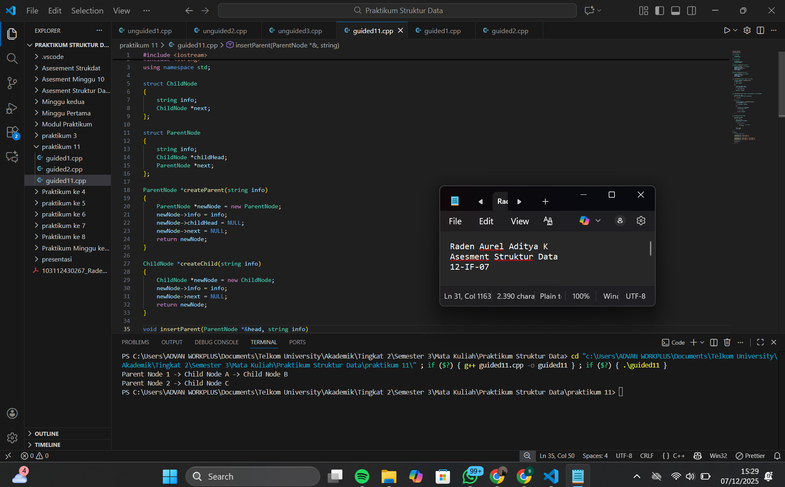
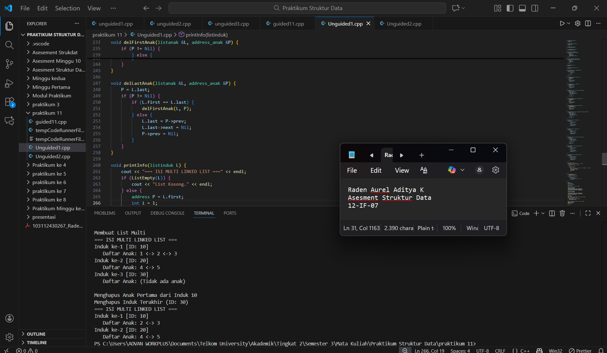
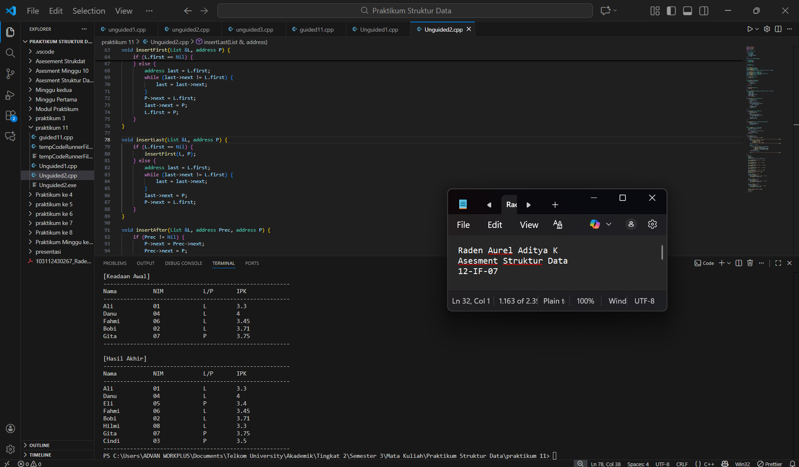

<h1 align="center">Laporan Praktikum 
  
  Modul 13 <br> MULTI LINKED LIST </h1>
<p align="center">Raden Aurel Aditya Kusumawaningyun - 103112430267</p>

## Dasar Teori Modul 13
A. Konsep Dasar Multi Linked List

Konsep dasar yang dipelajari dalam Modul 13 berfokus pada Multi Linked List, yaitu sebuah struktur data kompleks yang terdiri dari sekumpulan list yang berbeda namun saling terhubung satu sama lain dalam suatu relasi hierarkis. Dalam struktur ini, elemen data dikelompokkan menjadi dua peran utama, yaitu List Induk dan List Anak. Secara visual dan logis, setiap simpul pada list induk tidak hanya memiliki pointer untuk menunjuk ke elemen induk berikutnya, tetapi juga memiliki pointer khusus yang menjadi gerbang masuk menuju list anak yang dimilikinya, menciptakan hubungan one-to-many. Implikasi teknis dari struktur ini adalah pada operasi manipulasi data; misalnya, proses insert atau penghapusan elemen anak tidak dapat dilakukan secara langsung, melainkan harus didahului dengan pencarian posisi induk yang relevan. Selain itu, modul ini juga memperdalam pemahaman mengenai variasi linked list lainnya, seperti Circular Linked List, di mana elemen terakhir kembali menunjuk ke elemen pertama, yang diterapkan untuk kasus pengelolaan data yang membutuhkan siklus tertutup

## Guided Modul 13

### soal 1

```go
 #include <iostream>
#include <string>
using namespace std;

struct ChildNode
{
    string info;
    ChildNode *next;
};

struct ParentNode
{
    string info;
    ChildNode *childHead;
    ParentNode *next;
};

ParentNode *createParent(string info)
{
    ParentNode *newNode = new ParentNode;
    newNode->info = info;
    newNode->childHead = NULL;
    newNode->next = NULL;
    return newNode;
}

ChildNode *createChild(string info)
{
    ChildNode *newNode = new ChildNode;
    newNode->info = info;
    newNode->next = NULL;
    return newNode;
}

void insertParent(ParentNode *&head, string info)
{
    ParentNode *newNode = createParent(info);
    if (head == NULL)
    {
        head = newNode;
    }
    else
    {
        ParentNode *temp = head;
        while (temp->next != NULL)
        {
            temp = temp->next;
        }
        temp->next = newNode;
    }
}

void insertChild(ParentNode *head, string parentInfo, string childInfo)
{
    ParentNode *p = head;
    while (p != NULL && p->info != parentInfo)
    {
        p = p->next;
    }

    if (p != NULL)
    {
        ChildNode *newChild = createChild(childInfo);
        if (p->childHead == NULL)
        {
            p->childHead = newChild;
        }
        else 
        {
            ChildNode *c = p->childHead;
            while (c->next != NULL)
            {
                c = c->next;
            }
            c->next = newChild;
        }
    }
}

void printAll(ParentNode *head)
{
    ParentNode *p = head;
    while (p != NULL)
    {
        cout << p->info;
        ChildNode *c = p->childHead;
        if (c != NULL)
        {
            while (c != NULL)
            {
                cout << " -> " << c->info;
                c = c->next;
            }
        }
        cout << endl;
        p = p->next;
    }
}

int main()
{
    ParentNode *list = NULL;

    insertParent(list, "Parent Node 1");
    insertParent(list, "Parent Node 2");

    insertChild(list, "Parent Node 1", "Child Node A");
    insertChild(list, "Parent Node 1", "Child Node B");
    insertChild(list, "Parent Node 2", "Child Node C");

    printAll(list);

    return 0;
}
```


> Output
> 
> Berikut SS VS Code dari Program Soal No 1

penjelasan: 

Program ini mengimplementasikan struktur data Multi-Linked List menggunakan bahasa C++, di mana terdapat hubungan hierarkis antara data parent dan data child. Struktur dasar dibentuk melalui dua struct berbeda yaitu ParentNode yang memiliki pointer childHead untuk menunjuk ke awal daftar anak, dan ChildNode sebagai elemen sub-list. Logika utama program terletak pada mekanisme penyisipan data, fungsi insertParent bekerja secara linear untuk menyambungkan simpul induk, sedangkan fungsi insertChild memiliki kompleksitas lebih tinggi karena harus melakukan pencarian  terlebih dahulu untuk menemukan simpul induk yang sesuai dengan parentInfo. Setelah induk ditemukan, simpul anak baru dialokasikan dan disambungkan ke akhir dari daftar anak milik induk tersebut. Visualisasi data dilakukan oleh prosedur printAll menggunakan teknik nested traversal, di mana program mencetak satu simpul induk, menelusuri seluruh anak yang dimilikinya hingga NULL, baru kemudian berpindah ke simpul induk berikutnya.

## Unguided Modul 13

### soal 1

```go
 #include <iostream>
#include <string>
using namespace std;

struct ChildNode
{
    string info;
    ChildNode *next;
};

struct ParentNode
{
    string info;
    ChildNode *childHead;
    ParentNode *next;
};

ParentNode *createParent(string info)
{
    ParentNode *newNode = new ParentNode;
    newNode->info = info;
    newNode->childHead = NULL;
    newNode->next = NULL;
    return newNode;
}

ChildNode *createChild(string info)
{
    ChildNode *newNode = new ChildNode;
    newNode->info = info;
    newNode->next = NULL;
    return newNode;
}

void insertParent(ParentNode *&head, string info)
{
    ParentNode *newNode = createParent(info);
    if (head == NULL)
    {
        head = newNode;
    }
    else
    {
        ParentNode *temp = head;
        while (temp->next != NULL)
        {
            temp = temp->next;
        }
        temp->next = newNode;
    }
}

void insertChild(ParentNode *head, string parentInfo, string childInfo)
{
    ParentNode *p = head;
    while (p != NULL && p->info != parentInfo)
    {
        p = p->next;
    }

    if (p != NULL)
    {
        ChildNode *newChild = createChild(childInfo);
        if (p->childHead == NULL)
        {
            p->childHead = newChild;
        }
        else 
        {
            ChildNode *c = p->childHead;
            while (c->next != NULL)
            {
                c = c->next;
            }
            c->next = newChild;
        }
    }
}

void printAll(ParentNode *head)
{
    ParentNode *p = head;
    while (p != NULL)
    {
        cout << p->info;
        ChildNode *c = p->childHead;
        if (c != NULL)
        {
            while (c != NULL)
            {
                cout << " -> " << c->info;
                c = c->next;
            }
        }
        cout << endl;
        p = p->next;
    }
}

int main()
{
    ParentNode *list = NULL;

    insertParent(list, "Parent Node 1");
    insertParent(list, "Parent Node 2");

    insertChild(list, "Parent Node 1", "Child Node A");
    insertChild(list, "Parent Node 1", "Child Node B");
    insertChild(list, "Parent Node 2", "Child Node C");

    printAll(list);

    return 0;
}
```


> Output
> 
> Berikut SS VS Code dari Program Soal No 1

penjelasan: 
Program ini mengimplementasikan struktur data Multi-Linked List dengan skema Doubly Linked List yang diterapkan secara konsisten baik pada level parent maupun child. Struktur hierarkis dibentuk melalui struct elemen_list_induk yang tidak hanya menyimpan data integer dan pointer navigasi (, tetapi juga secara unik mewadahi struktur listanak di dalamnya, menciptakan relasi one-to-many di mana satu induk memiliki kontrol penuh atas daftar anaknya sendiri. Alur kerja utama dalam fungsi main mendemonstrasikan siklus hidup data: dimulai dengan inisialisasi list, dilanjutkan dengan alokasi dan penyisipan node induk bernilai 10, 20, dan 30 beserta node anak yang relevan anak 1-3 untuk induk 10, anak 4-5 untuk induk 20. Program juga menguji validitas manipulasi data melalui operasi penghapusan, spesifiknya menghapus anak pertama dari induk 10 dan menghapus induk terakhir yaitu node 30. Validasi akhir dilakukan oleh prosedur printInfo yang menjalankan mekanisme nested traversal penelusuran bersarang, di mana program menelusuri rantai induk satu per satu sembari mencetak sub-list anak yang terhubung pada setiap simpul induk tersebut.

### soal 2

```go
#include <iostream>
#include <string>
#include <iomanip> 
#define Nil NULL

using namespace std;

struct infotype {
    string nama;
    string nim;
    char jenis_kelamin;
    float ipk;
};

typedef struct Element *address;

struct Element {
    infotype info;
    address next;
};

struct List {
    address first;
};

void createList(List &L);
address alokasi(infotype x);
void dealokasi(address P);
address createData(string nama, string nim, char jk, float ipk);

void insertFirst(List &L, address P);
void insertLast(List &L, address P);
void insertAfter(List &L, address Prec, address P);
address findElm(List L, string nim);
void printInfo(List L);

void createList(List &L) {
    L.first = Nil;
}

address alokasi(infotype x) {
    address P = new Element;
    if (P != Nil) {
        P->info = x;
        P->next = Nil;
    }
    return P;
}

void dealokasi(address P) {
    delete P;
}

address createData(string nama, string nim, char jk, float ipk) {
    infotype x;
    x.nama = nama;
    x.nim = nim;
    x.jenis_kelamin = jk;
    x.ipk = ipk;
    return alokasi(x);
}

void insertFirst(List &L, address P) {
    if (L.first == Nil) {
        L.first = P;
        P->next = L.first;
    } else {
        address last = L.first;
        while (last->next != L.first) {
            last = last->next;
        }
        P->next = L.first;
        last->next = P;
        L.first = P;
    }
}

void insertLast(List &L, address P) {
    if (L.first == Nil) {
        insertFirst(L, P);
    } else {
        address last = L.first;
        while (last->next != L.first) {
            last = last->next;
        }
        last->next = P;
        P->next = L.first;
    }
}

void insertAfter(List &L, address Prec, address P) {
    if (Prec != Nil) {
        P->next = Prec->next;
        Prec->next = P;
    }
}

address findElm(List L, string nim) {
    if (L.first == Nil) return Nil;
    address P = L.first;
    do {
        if (P->info.nim == nim) return P;
        P = P->next;
    } while (P != L.first);
    return Nil;
}

void printInfo(List L) {
    if (L.first == Nil) {
        cout << "List Kosong." << endl;
    } else {
        cout << "--------------------------------------------------------" << endl;
        cout << left << setw(15) << "Nama" 
             << setw(15) << "NIM" 
             << setw(10) << "L/P" 
             << setw(10) << "IPK" << endl;
        cout << "--------------------------------------------------------" << endl;
        
        address P = L.first;
        do {
            cout << left << setw(15) << P->info.nama 
                 << setw(15) << P->info.nim 
                 << setw(10) << P->info.jenis_kelamin 
                 << setw(10) << P->info.ipk << endl;
            P = P->next;
        } while (P != L.first);
        
        cout << "--------------------------------------------------------" << endl;
    }
}

int main() {
    List L;
    createList(L);
    address P1 = Nil, P2 = Nil, P_Cari = Nil;

    P1 = createData("Danu", "04", 'L', 4.0);
    insertFirst(L, P1); 

    P1 = createData("Ali", "01", 'L', 3.3);
    insertFirst(L, P1); 

    P1 = createData("Fahmi", "06", 'L', 3.45);
    insertLast(L, P1); 

    P1 = createData("Bobi", "02", 'L', 3.71);
    insertLast(L, P1);

    P1 = createData("Gita", "07", 'P', 3.75);
    insertLast(L, P1); 
    cout << "\n[Keadaan Awal]" << endl;
    printInfo(L);

    P_Cari = findElm(L, "07"); 
    if (P_Cari != Nil) {
        P2 = createData("Cindi", "03", 'P', 3.5);
        insertAfter(L, P_Cari, P2);
    }

    P_Cari = findElm(L, "02");
    if (P_Cari != Nil) {
        P2 = createData("Hilmi", "08", 'L', 3.3);
        insertAfter(L, P_Cari, P2);
    }

    P_Cari = findElm(L, "04");
    if (P_Cari != Nil) {
        P2 = createData("Eli", "05", 'P', 3.4);
        insertAfter(L, P_Cari, P2);
    }

    cout << "\n[Hasil Akhir]" << endl;
    printInfo(L);

    return 0;
}
```


> Output
> 
> Berikut SS VS Code dari Program Soal No 2

penjelasan: 
Program ini adalah implementasi struktur data Circular Singly Linked List untuk mengelola data kemahasiswaan. Struktur data utama dibentuk menggunakan struct Element yang menyimpan tipe data bentukan infotype berisi Nama, NIM, Jenis Kelamin, dan IPK, serta pointer next yang menghubungkan antar elemen . Berbeda dengan linked list biasa, pointer next pada elemen terakhir dalam struktur ini tidak menunjuk ke NULL, melainkan kembali menunjuk ke elemen pertama, menciptakan siklus tertutup. Fitur utama program ini mencakup operasi penyisipan data di berbagai posisi insertFirst, insertLast serta penyisipan spesifik menggunakan insertAfter yang didahului dengan pencarian elemen referensi menggunakan fungsi findElm berdasarkan NIM. Dalam fungsi utama, program mensimulasikan skenario penyisipan data mahasiswa secara bertahap—mulai dari penyisipan awal (Danu, Ali), penyisipan di akhir (Fahmi, Bobi, Gita), hingga penyisipan di tengah (Cindi, Hilmi, Eli) berdasarkan referensi NIM tertentu—yang pada akhirnya menghasilkan daftar mahasiswa yang terurut secara sirkular sesuai dengan spesifikasi soal latihan.

## Daftar Pustaka

Laboratorium Informatika. (2025). Modul 13: Multi Linked List. Fakultas Informatika, Telkom University.

Lipschutz, S. (2014). Data Structures with C (Schaum’s Outline Series). McGraw-Hill Education.

Frieyadie. (2016). Penerapan struktur data senarai berantai ganda (doubly linked list) untuk pembuatan sistem informasi rekam medis. Jurnal TECHNO Nusa Mandiri, 13(2), 108–114. https://doi.org/10.33480/techno.v13i2.152

Kurniawan, H., & Suanto, S. (2017). A performance comparison between the linear queue and the circular queue in web servers. Proceedings of the 2017 International Conference on Information Management and Technology (ICIMTech), 178–182. https://doi.org/10.1109/ICIMTech.2017.8273531

Nurdin, A., & Setiawan, I. (2020). Implementasi struktur data linked list pada sistem antrian pelayanan pelanggan. Jurnal Algoritma, 17(2), 154–160. https://jurnal.itg.ac.id/index.php/algoritma/article/view/728
